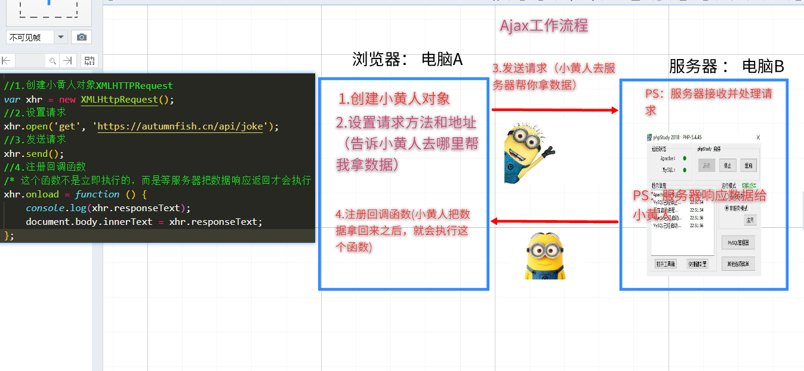

## Ajax

### 使用 Ajax 请求数据的 5 种方式

| 请求方式 |                             描述                             |
| :------: | :----------------------------------------------------------: |
|   POST   |                     向服务器**新增**数据                     |
|   GET    |                     从服务器**获取**数据                     |
|  DELETE  |                    **删除**服务器上的数据                    |
|   PUT    | 更新服务器上的数据（侧重于**完整更新**：例如更新用户的完整信息） |
|  PATCH   | 更新服务器上的数据（侧重于**部分更新**：例如只更新用户的手机号） |

### 浏览器访问服务器的几种方式

```html
</head>

<a href="http://192.168.137.1">点我跳转</a>
<button id="btn">点我也可以跳转哟</button>

<body>
    <script>
        /*几种访问服务器的方式
        1.直接在浏览器地址栏输入网址
        2.使用a标签的href属性
        3.使用window.location.href 
         */

        document.getElementById('btn').onclick = function(){
            window.location.href = 'https://www.magicdoge.top';
        };
    </script>
</body>
```

### ajax的工作流程

* 1.创建XMLHttpRequest对象（俗称小黄人）
  * `let xhr = new XMLHttpRequest();`
* 2.设置请求
  * `xhr.open('get', 'https://autumnfish.cn/api/joke');`
* 3.发送请求
  * `xhr.send();`
* 4.注册回调函数
  * * 这个函数不是立即执行的，而是等服务器把数据响应返回才会执行（PS：什么时候执行取决于你的网速快慢）
    * `xhr.onload = function () {console.log(xhr.responseText);}`



```html
<body>
    <script>
      
        /* 1.ajax： 在页面不刷新的情况下向服务器请求数据
           2.XMLHttpRequest ： http请求对象，负责实现ajax技术（小黄人）
                （1）创建XMLHttpRequest对象
                        * 小黄人，相当于黄袍加身的跑腿外卖小哥哥
                （2）设置请求
                        * 告诉小黄人服务器地址
                （3）发送请求
                        * 小黄人出发去指定地址取外卖（数据）
                            * 2G网速：走路去的
                            * 3G网速：骑膜拜去的
                            * WIFI : 骑电动车去的
                            * 4G   ： 骑小牛牌电动车去的
                （4）注册回调函数
                        * 小黄人把取回的外卖送到你家门口
        
         */

        //1.创建小黄人对象XMLHTTPRequest
        let xhr = new XMLHttpRequest();
        //2.设置请求
        xhr.open('get', 'https://autumnfish.cn/api/joke');
        //3.发送请求
        xhr.send();
        //4.注册回调函数
        /* 这个函数不是立即执行的，而是等服务器把数据响应返回才会执行（PS：什么时候执行取决于你的网速快慢） */
        xhr.onload = function () {
            console.log(xhr.responseText);
            document.body.innerText = xhr.responseText;
        };
    </script>
</body>
```

### 看笑话案例


```html
  <body>
    <input type="button" value="点我看笑话" class="getJoke" />
    <div class="joke-container"></div>

    <script src="./libs/jquery-1.12.4.min.js"></script>
    <script>
      /*
          随机获取笑话的接口
      
          - 请求地址：https://autumnfish.cn/api/joke
          - 请求方法：get
          - 请求参数：无
          - 响应内容：随机笑话
      
          思路步骤
      
          1. 给按钮注册点击事件 onclick
          2. 通过ajax调用 笑话接口
          3. 数据返回之后 显示到div中
       */
      document.querySelector(".getJoke").onclick = function() {
        // 1.创建小黄人对象
        let xhr = new XMLHttpRequest()
        // 2.设置请求的方法和地址
        xhr.open("get", "https://autumnfish.cn/api/joke")
        // 3.发送请求
        xhr.send()
        // 4.注册回调函数
        xhr.onload = function() {
          // console.log(xhr.responseText)
          // 显示到div中
          document.querySelector('.joke-container').innerText = xhr.responseText
        }
      }
    </script>
  </body>
```


### Ajax发送get请求


```html
    <script>
      /*
        1.get传参格式： url?key=value
        2.示例： https://autumnfish.cn/api/joke/list?num=10
      */

      // 1.实例化ajax对象
      let xhr = new XMLHttpRequest()
      // 2.设置请求方法和地址
      // get请求的数据直接添加在url的后面 格式是 url?key=value
      xhr.open("get", "https://autumnfish.cn/api/joke/list?num=10")
      // 3.发送请求
      xhr.send()
      // 4.注册回调函数
      xhr.onload = function() {
        console.log(xhr.responseText)
      }
    </script>
```

### Ajax发送post请求


```html
    <script>
      /* 
        请求方法get和post区别： 传参方式不同
            get请求： 直接在url后面拼接参数
                * 参数在url中，安全性不高
            post请求：
                1.需要设置请求头（固定语法）：xhr.setRequestHeader('Content-type','application/x-www-form-urlencoded')
                    * 注意：这是固定格式，错一个字母都不行，强烈建议复制粘贴
                2.使用xhr的send方法发送参数： xhr.send('参数名=参数值');
                    * 注意：不要加前面的? 
      */
     
      //(1).实例化ajax对象
      let xhr = new XMLHttpRequest()
      //(2).设置请求方法和地址
      xhr.open("post", "https://autumnfish.cn/api/user/register")
      //(3).设置请求头（post请求才需要设置）
      xhr.setRequestHeader("Content-type", "application/x-www-form-urlencoded")
      //(4).发送请求 ： 参数格式  'key=value'
      xhr.send("username=admin")
      //(5).注册回调函数
      xhr.onload = function() {
        console.log(xhr.responseText)
      }
    </script>
```


### 用户登录案例


```html
    <script>
      /* 思路分析:交互
		  1.点击登录按钮
			  1.1 获取用户输入的文本
			  1.2 ajax发送post请求
			  1.3 服务器响应数据
				code:200  成功，跳转首页
				code:500  失败，弹窗提示用户
		  */

      // 登录功能
      document.querySelector("#btnLogin").onclick = function() {
        //1.1 获取用户输入的文本
        let username = document.querySelector("#username").value
        let password = document.querySelector("#password").value
        //1.2 ajax发送post请求
        //(1).实例化ajax对象
        let xhr = new XMLHttpRequest()
        //(2).设置请求方法和地址
        xhr.open("post", "http://www.liulongbin.top:3009/api/login")
        //(3).设置请求头（post请求才需要设置）
        xhr.setRequestHeader(
          "Content-type",
          "application/x-www-form-urlencoded"
        )
        //(4).发送请求 ： 参数格式  'key=value'
        xhr.send(`username=${username}&password=${password}`)
        //(5).注册回调函数
        xhr.onload = function() {
          //1.3 服务器响应数据 （需要解析json->js）
          let res = JSON.parse(xhr.responseText)
          console.log(res)
          if (res.code == 500) {
            alert(res.msg)
          } else {
            alert("登录成功")
            location.href = "http://www.baidu.com"
          }
        }
      }
    </script>

```


### 新闻列表案例


```html
  <script>
    /* 思路分析
    1.请求数据(页面一加载，立刻获取数据，不需要事件的触发)
    2.渲染结构
    */

    // 1.请求数据(页面一加载，立刻获取数据，不需要事件的触发)
    //(1).实例化ajax对象
    let xhr = new XMLHttpRequest()
    //(2).设置请求方法和地址
    //get请求的数据直接添加在url的后面 格式是 url?key=value
    xhr.open('get', 'http://www.liulongbin.top:3009/api/news')
    //(3).发送请求
    xhr.send()
    //(4).注册回调函数
    xhr.onload = function() {
      //4.1 服务器返回JSON -> JS对象
      let res = JSON.parse(xhr.responseText)
      console.log(res)
      //4.2  渲染页面
      renderData(res.data)
    }

    /* 将数据渲染到页面有两种方式
      第一种：DOM驱动。  
        方式: 遍历数组,创建元素添加到页面
        弊端: DOM操作比较繁琐
      第二种: 数据驱动。 
        方式: 将数组 隐射成 html字符串，直接替换元素innerHTML
        好处: 无需操作DOM,只需要操作数据即可
    */
    

    //第一种： DOM驱动。webapi阶段的方式,今后不再使用
    function renderDom(arr){
      for(let i = 0;i<arr.length;i++){
        //(1)创建元素
        let div = document.createElement('div')
        //(2)设置内容
        div.innerHTML = `<div class="news-item">
        
        <div class="right-box">
        <!-- 新闻标题 -->
        <h1 class="title">${arr[i].title}</h1>
        <div class="footer">
          <div>
            <!-- 新闻来源 -->
            <span>${arr[i].source}</span>&nbsp;&nbsp;
            <!-- 发布日期 -->
            <span>${arr[i].time}</span>
          </div>
          <!-- 评论数量 -->
          <span>评论数：${arr[i].cmtcount}</span>
        </div>
        </div>
        </div>`
        //(3)添加到页面
        document.querySelector('#news-list').appendChild(div)
      }
    }


    //第二种: 数据驱动。 今后学习和开发推荐方式
    const renderData = arr=>{
      document.querySelector('#news-list').innerHTML = arr.map(item=>{
        return `<div class="news-item">
        
        <div class="right-box">
        <!-- 新闻标题 -->
        <h1 class="title">${item.title}</h1>
        <div class="footer">
          <div>
            <!-- 新闻来源 -->
            <span>${item.source}</span>&nbsp;&nbsp;
            <!-- 发布日期 -->
            <span>${item.time}</span>
          </div>
          <!-- 评论数量 -->
          <span>评论数：${item.cmtcount}</span>
        </div>
        </div>
        </div>`
      }).join('')
    }

  </script>
```


### 水果列表案例


```html
    <script>
      /* 思路分析
      1.页面一加载,发送ajax请求
      2.服务器响应数据,渲染到页面
      */

      //(1).实例化ajax对象
      let xhr = new XMLHttpRequest()
      //(2).设置请求方法和地址
      //get请求的数据直接添加在url的后面 格式是 url?key=value
      xhr.open("get", "https://autumnfish.cn/fruitApi/fruits")
      //(3).发送请求
      xhr.send()
      //(4).注册回调函数
      xhr.onload = function() {
        // 4.1 将JSON ——> JS对象
        let res = JSON.parse(xhr.responseText)
        console.log(res)
        // 4.2 渲染页面
        renderData(res.data)
      }

      /* 将数据渲染到页面有两种方式
      第一种：DOM驱动。  
        方式: 遍历数组,创建元素添加到页面
        弊端: DOM操作比较繁琐
      第二种: 数据驱动。 
        方式: 遍历数组,拼接html字符串直接替换innerHTML
        好处: 无需操作DOM,只需要操作数据即可
      */
      const renderData = arr => {
        document.querySelector(".tbody").innerHTML = arr.map(item => {
          return `<div class="tr">
              <div class="td">${item.name}</div>
              <div class="td">
                
              </div>
              <div class="td">
                <span class="my-input__inner count">${item.info}</span>
              </div>
              <div class="td">
                <button class="info">查看详情</button>
              </div>
            </div>`
          }).join("")
      }
    </script>
```

## axios

中文官网地址：http://www.axios-js.com/
英文官网地址：https://www.npmjs.com/package/axios

### axios 的基础语法

```js
<script>
    axios({
      method: '请求的类型',
      url: '请求的URL地址'
    }).then((result) => {
      // .then 用来指定请求成功之后的回调函数
      // 形参中的 result 是请求成功之后的结果
    })
</script>
```

### 基于 axios 发起 GET 请求

测试 GET 请求的 URL 地址为 http://www.liulongbin.top:3009/api/getbooks

```js
  <script>
    axios({
      method: 'GET',
      url: 'http://www.liulongbin.top:3009/api/getbooks'
    }).then((result) => {
      console.log(result)
    })
  </script>
```

打印 result 得到的结果：


### GET 请求的查询参数

```js
  <script>
    axios({
      // 1.发起GET请求
      method: 'GET',
      // 2. 指定请求的 URL 地址
      url: 'http://www.liulongbin.top:3009/api/getbooks',
      // 3. 查询的参数
      params: {
        id:1
      }
    }).then((result) => {
      // 4. 请求成功之后的回调函数
      console.log(result)
    })
  </script>
```

### 查询参数的本质

在使用 Ajax 发起 GET 请求时的参数，会以 **?键=值** 的形式拼接到 **URL 地址的末尾**。

注意：? 后面的都是**查询参数**，查询参数的**键和值**之间使用 = 进行分隔

```js
  <script>
    axios({
      method: 'GET',
      // 直接在 URL 地址的末尾,手动拼接查询的参数
      url: 'http://www.liulongbin.top:3009/api/getbooks?id=1'
    }).then((result) => {
      console.log(result)
    })
  </script>
```

### 在 GET 请求中携带多个查询参数

```js
  <script>
    axios({
      method: 'GET',
      url: 'http://www.liulongbin.top:3009/api/getbooks',
      // 查询 id 等于1 并且 bookname 等于 西游记 的书
      params: {
        id: 1,
        bookname: '西游记'
      }
    }).then((result) => {
      console.log(result)
    })
  </script>
```

最终，在 URL 地址的末尾，多个查询参数之间使用 & 符号进行分隔：
http://www.liulongbin.top:3009/api/getbooks?id=1&bookname='西游记'

### URL 编码

在 URL 地址中**不允许出现中文、空格等特殊字符**，因此浏览器会**自动**对 URL 地址内的中文进行**转换处理**。例如：


浏览器内置了 `encodeURI()` 和 `decodeURI()` 两个方法，用来实现 URL 的编码和解码处理：


### result 是 axios 套壳的结果

服务器端响应给 axios 的**原始数据**，被 axios 在外面“**套了一层壳**”，示意图如下：


### 在函数的形参中使用解构赋值

使用`解构赋值`，可以轻松地获取到 axios 请求回来的`真实数据`。示例代码如下：

```js
  <script>
    axios({
      method: 'GET',
      url: 'http://www.liulongbin.top:3009/api/getbooks'
    }).then(({data:res}) => {
      // 从 .then(fn) 回调函数的形参中，解构赋值出 data 属性，重命名为 res
      console.log(res)
    })
  </script>
```

### 基于 axios 发起 POST 请求

```js
  <script>
    axios({
      // 1. 请求方式
      method: 'POST',
      // 2. 请求的 URL 地址
      url: 'http://www.liulongbin.top:3009/api/addbook',
      // 3. data 是要提交给服务器的数据
      data: {
        bookname: '玛卡巴卡不回家',
        author: '玛卡巴卡',
        publisher: '花园宝宝出版社'
      }
    }).then((result) => {
      console.log(result)
    })
```

### POST 提交数据的方式

POST 请求提交的数据，`并没有拼接到 URL 地址的末尾`

各个浏览器对 `URL` 的长度有限制


### GET 和 POST 提交数据的区别

GET 请求只能在 URL 中携带`少量`的数据

POST 请求适合用来提交`大量`的数据

POST 为了能够提交大量的数据，所以`没有把数据拼接到 URL 的末尾`；而是放到了独立的“`请求体`”中

### 小知识

POST请求可以发送 `params` 参数  也可同时发送 `data`和 `params`

GET请求不能发送`data(请求体)`数据

### 请求报文 - 格式

`请求报文`由`请求行`（request line）、`请求头部`（ header ）、`空行` 和 `请求体` 4 个部分组成


注意：

在浏览器中，GET 请求比较特殊，它只有请求头，没有请求体

在浏览器中，POST、PUT、PATCH、DELETE 请求既有请求头，又有请求体

### 响应报文 - 格式

`响应报文`由`状态行`、`响应头部`、`空行` 和 `响应体` 4 个部分组成


### 常见的 http 响应状态码

| 状态码 |      状态码描述       |                        说明                        |
| :----: | :-------------------: | :------------------------------------------------: |
|  200   |          OK           |                     请求成功。                     |
|  201   |        Created        |             资源在服务器端已成功创建。             |
|  304   |     Not Modified      |  资源在客户端被缓存，响应体中不包含任何资源内容！  |
|  400   |      Bad Request      |  客户端的请求方式、或请求参数有误导致的请求失败！  |
|  401   |     Unauthorized      |  客户端的用户身份认证未通过，导致的此次请求失败！  |
|  404   |       Not Found       | 客户端请求的资源地址错误，导致服务器无法找到资源！ |
|  500   | Internal Server Error |        服务器内部错误，导致的本次请求失败！        |

### http 响应状态码 Vs 业务状态码

1- 所处的位置不同：

在`响应头`的`状态行`中所包含的状态码，叫做“`响应状态码`”

在`响应体`的`数据`中所包含的状态码，叫做“`业务状态码`”

2-表示的结果不同：

响应状态码只能表示`这次请求`的成功与否（成功或失败）

业务状态码用来表示`这次业务处理`的成功与否

3- 通用性不同：

响应状态码是由` http 协议规定`的，`具有通用性`。每个不同的状态码都有其标准的含义，不能乱用。

业务状态码是后端程序员`自定义`的，`不具有通用性`。

### 接口文档的格式

|   组成部分   |                             说明                             |
| :----------: | :----------------------------------------------------------: |
|   接口名称   | 接口的名称，用来快速区分每个接口的作用。如：登录接口、添加图书接口 |
|   接口 URL   |        客户端发起 Ajax 调用此接口时，请求的 URL 地址         |
|   请求方式   |        接口的请求方式，如：GET、POST、PUT、DELETE 等         |
|   请求参数   |       请求此接口时，需要发送到服务器的查询参数或请求体       |
|   返回示例   |       当接口请求成功后，服务器响应回来的数据的基本格式       |
| 返回参数说明 |                    接口响应结果的详细描述                    |

### 接口测试工具

最流行的接口测试工具是 Postman，它的官方下载地址如下：https://www.postman.com/downloads/

使用 Postman 测试 GET 接口


使用 Postman 测试 POST 接口


## form 表单

在网页中，表单主要负责`数据采集功能`。

网页中采集数据的表单由三个部分组成，分别是：`表单标签`、`表单域`、`表单按钮`。

### 表单的三个组成部分 - 表单标签

HTML 的 `<form> `就是表单标签，它是一个“`容器`”，用来将`页面上指定的区域`划定为`表单区域`：


### 表单的三个组成部分 - 表单域

`表单域`提供了`采集用户信息的渠道`，常见的表单域有：input、textarea、select 等。


注意：每个表单域`必须包含 name 属性`，否则用户填写的信息`无法被采集到`！

### 表单的三个组成部分 - 表单按钮

当表单数据填写完毕后，用户点击`表单按钮`，会`触发`表单的`提交操作`，从而把采集到的数据`提交给服务器`。


注意：
① `type="submit"` 表示`提交按钮`的意思
② type 属性的`默认值`就是 `submit`，因此 type="submit" `可以省略不写`

### < form> 标签的属性一览表

< form > 标签最重要的 3 个属性分别是 action、method 和 enctype。简介信息如下表所示：

|  属性   |                            可选值                            |                             说明                             |
| :-----: | :----------------------------------------------------------: | :----------------------------------------------------------: |
| action  |                       接口的 url 地址                        |             把表单采集到的数据，提交到哪个接口中             |
| method  |                         GET 或 POST                          |               数据的提交方式（默认值为 `GET`）               |
| enctype | application/x-www-form-urlencoded<br/>multipart/form-data<br/>~~text/plain（很少用）~~ | 数据的编码格式。具体指的是：<br/>把表单数据提交给服务器之前，如何对将要提交的数据进行编码<br/>（默认值 `application/x-www-form-urlencoded`） |

注意：enctype 属性只能搭配 `POST` 提交方式一起使用；如果是 GET 提交，则 enctype 没有意义！

### 以 GET 方式提交表单数据

在 < form > 标签上，通过 `action` 属性指定`提交的 URL 地址`，通过 `method `属性指定提交的方式为 `GET`：

```html
  <form action="http://www.liulongbin.top:3009/api/form" method="GET">
    <div>
      <span>用户名</span>
      <input type="text" name="username" autocomplete="off">
    </div>

    <div>
      <span>密码</span>
      <input type="text" name="password">
    </div>

       <button>提交</button>
  </form>
```

注意：由于 method 属性的`默认值`就是 `GET`，因此上述的 `method="GET" 可以被省略`！

### 以 POST 方式提交表单数据

在 <form> 标签上，通过 `action `属性指定提交的 URL 地址，通过 `method` 属性指定提交的方式为 `POST`，并通过`enctype `属性指定数据的编码方式为 `application/x-www-form-urlencoded：`

```html
  <form action="http://www.liulongbin.top:3009/api/form" 
        method="post"
        enctype="application/x-www-form-urlencoded">
    <div>
      <span>用户名</span>
      <input type="text" name="username">
    </div>

    <div>
      <span>密码</span>
      <input type="text" name="password">
    </div>

    <button>提交</button>
  </form>
```

注意：由于 `enctype `的默认值就是 `application/x-www-form-urlencoded`，因此上述的 `enctype 可以被省略`！

### enctype 三个可选值之间的区别

只有 `method `属性的值等于` POST` 时，`才有必要设置 enctype 属性`。它的属性可选值有三个：

|              属性值               | 是否常用 |                      应用场景                      |
| :-------------------------------: | :------: | :------------------------------------------------: |
| application/x-www-form-urlencoded |    是    | 表单中`不包含文件上传`的场景，适用于普通数据的提交 |
|        multipart/form-data        |    是    |             表单中`包含上传文件`的场景             |
|            text/plain             |    否    |                         无                         |

### 通过 Ajax 提交表单数据

通过 Ajax 提交表单采集到的数据，可以**防止**表单默认提交行为导致的页面跳转问题，提高用户的体验。

1. 监听表单的 submit 提交事件
2. 阻止默认提交行为
3. 基于 axios 发起请求
4. 指定请求方式、请求地址
5. 指定请求体数据


## axios 请求方法的别名

在实际开发中，常用的 5 种请求方式分别是：`GET、POST、PUT、PATCH、DELETE`

为了简化开发者的使用过程，axios 为所有支持的请求方法提供了别名：

- axios.`get`(url[, config])
- axios.`delete`(url[, config])
- axios.`post`(url[, data[, config]])
- axios.`put`(url[, data[, config]])
- axios.`patch`(url[, data[, config]])

### axios.get() 的用法


### axios.post() 的用法


### 全局配置请求根路径

在 url 地址中，**协议://域名:端口** 对应的部分叫做“请求根路径”。

全局配置请求根路径的**好处**：提高项目的**可维护性**。

`axios.defaults.baseURL = '请求根路径'`


## axios 拦截器

拦截器（interceptors）用来**全局拦截** axios 的**每一次请求与响应**。

好处：可以把每个请求中，某些**重复性的业务代码**封装到拦截器中，提高代码的复用性。


### 不使用拦截器 - 实现 loading 效果

需要在每个请求中分别展示和隐藏 loading 效果。示例代码如下：


### 使用拦截器 - 实现 loading 效果

在请求拦截器中展示 loading 效果：**axios官网复制代码**


在响应拦截器中隐藏 loading 效果：


## 文件上传 FormData

概念：`FormData` 是浏览器提供的一个 `WebAPI`，它以**键值对**的方式存储数据。

作用：FormData 配合 Ajax 技术，能够向服务器发送 `multipart/form-data` 格式的请求体数据。

典型应用场景：FormData + Ajax 技术实现**文件上传**的功能。

注意：Ajax 实现文件上传的时候，**请求体**的**编码格式**必须是 `multipart/form-data`。

## FormData 的基本用法

FormData 是一个**构造函数**，`new FormData()` 即可得到 FormData 对象：

```js
const fd = new FormData() // 创建一个空白的 FormData 对象，里面没有包含任何数据。
```

调用 FormData 对象的 `append`(键, 值) 方法，可以向空白的 FormData 中追加**键值对**数据，其中：

- **键**表示**数据项的名字**，必须是**字符串**
- **值**表示**数据项的值**，可以是**任意类型**的数据

```js
fd.append('username', '张三') // 键是 username，值是字符串类型
fd.append('age', 20) // 键是 age，值是数字类型
fd.append('avatar', 图片文件) // 键是 avatar，值是文件类型
```

### 发送普通的 FormData 数据

FormData + axios 向服务器提交普通的数据（不包含文件上传）：


## 数据交换格式

数据交换格式，就是服务器端与客户端之间数据传输的格式。

两种数据交换格式：
① XML（很少用）
② `JSON`（主流）


### JSON

JSON（全称：JavaScript Object Notation）是一种数据交换格式，它本质上是用字符串的方式来表示对象或数组类型的数据。例如：


用字符串的方式来表示的对象或数组类型的数据，叫做 JSON 数据。

JSON 数据的格式有两种：
① 对象格式
② 数组格式

### 对象格式的 JSON 数据

对象格式的 JSON 数据，最外层使用 { } 进行包裹，内部的数据为 key: value 的键值对结构。其中：
① key 必须使用**英文的双引号**进行包裹
② value 的值只能是**字符串、数字、布尔值、null、数组、对象类型**（可选类型只有这**6 种**）


### 数组格式的 JSON 数据

数组格式的 JSON 数据，最外层使用 [ ] 进行包裹，内部的每一项数据之间使用英文的 , 分隔。其中：
每一项的值类型只能是**字符串、数字、布尔值、null、数组、对象**这 **6 种类型之一**。


### 把 JSON 数据转换为 JS 数据

调用浏览器内置的 `JSON.parse()` 函数，可以把 JSON 格式的字符串转换为 JS 数据，例如：


### 把 JS 数据转换为 JSON 数据

调用浏览器内置的 `JSON.stringify() `函数，可以把 JS 数据转换为 JSON 格式的字符串，例如：


### 序列化和反序列化

① 把**真实数据**转换为**字符串**的过程，叫做**序列化**
② 把**字符串**转换为**真实数据**的过程，叫做**反序列化**


### 把 XMLHttpRequest 请求到的 JSON 数据反序列化为 JS 对象

在 xhr 对象的 load 事件中，通过 xhr.response 访问到的是 JSON 格式的字符串数据。可以调用 JSON.parse() 函数将 xhr.response 转化为 JS 对象。示例代码如下：


## JSON 文件的语法要求

在 JSON 文件中定义 JSON 格式的数据时，要遵守以下的 6 条规则：

1. **属性名**必须使用**双引号**包裹
2. **字符串**类型的值必须使用**双引号**包裹
3. JSON 中**不允许使用单引号**表示字符串
4. JSON 中**不能写注释**
5. JSON 的**最外层**必须是**对象或数组**格式
6. 不能使用 **undefined** 或**函数**作为 JSON 的值

## 同源策略 & 跨域

### 同源

同源指的是两个 URL 地址具有**相同的协议**、**主机名**、**端口号**。

浏览器的同源策略规定：不允许非同源的 URL 之间进行资源的交互。

### 跨域

同源指的是两个 URL 的协议、主机名、端口号完全一致，反之，则是跨域。

出现跨域的根本原因：浏览器的同源策略不允许非同源的 URL 之间进行资源的交互。例如：
⚫ 网页：http://www.test.com/index.html
⚫ 接口：http://www.api.com/userlist
⚫ 受到同源策略的限制，上面的网页请求下面的接口会失败！

## 防抖 & 节流

### 防抖

防抖（debounce）指的是：频繁触发某个操作时，只执行最后一次。


### 节流

节流（throttle）指的是：单位时间内，频繁触发同一个操作，只会触发 1 次。


