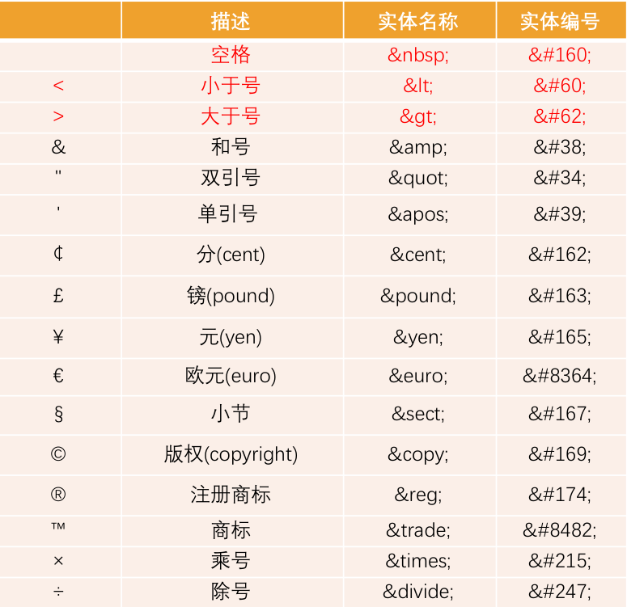

## 标题标签

```html
<body>
    <h1> 一级标题</h1>
    <h2> 二级标题</h2>
    <h3> 三级标题</h3>
    <h4> 四级标题</h4>
    <h5> 五级标题</h5>
    <h6> 六级标题</h6>
</body>
```

- 文字都有加粗
- 文字都有变大，并且从h1 → h6文字逐渐减小
- 独占一行

**注意点：h1标签对于网页尤为重要，开发中有特定的使用场景，如：新闻的标题、网页的logo部分**

## 段落标签

```html
<body>
  <p>玛卡巴卡</p>
</body>
```

- 段落之间存在间隙
- 独占一行

## 换行标签

- 单标签
- 让文字强制换行

## 水平线标签

```html
<body>
  <p>玛卡巴卡<hr>不回家</p>
</body>
```

- 单标签 
- 在页面中显示一条水平线

## 文本格式化标签

|  **语义**  |      **标签**      |
| :--------: | :----------------: |
|  **加粗**  | < strong></strong> |
|  **倾斜**  |     < em><em>      |
| **删除线** |    < del></del>    |
| **下划线** |    < ins></ins>    |

## 图片标签

```html

```

## 音频标签

|   属性   |   描述   |
| :------: | :------: |
| autoplay | 自动播放 |
| controls | 播放控件 |
|   loop   | 循环播放 |
|   src    | 音频路径 |

## 视频标签

|   属性   |                  值                  |                        描述                         |
| :------: | :----------------------------------: | :-------------------------------------------------: |
| autoplay |               autoplay               | 自动播放(谷歌浏览器需要添加muted来解决自动播放问题) |
| controls |               controls               |                      播放控件                       |
|  width   |             pixels(像素)             |                   设置播放器宽度                    |
|  height  |             pixels(像素)             |                   设置播放器高度                    |
|   loop   |                 loop                 |                      循环播放                       |
| preload  | auto(预先加载视频)none(不应加载视频) |  规定是否预加载视频(如果有了autoplay 就忽略该属性)  |
|   src    |                 url                  |                      视频路径                       |
|  poster  |                lmgurl                |                 加载等待的画面图片                  |
|  muted   |                muted                 |                      静音播放                       |

## 链接标签

```html
<a href="跳转目标" target="_blank">文本或图像</a>
```

target="_blank 新窗口打开

**如果 href 里面地址是一个文件或者压缩包，会下载这个文件**

```html
<a href="magicdoge.zip"></a>
```

- a标签默认文字有下划线
- a标签从未点击过，默认文字显示蓝色
- a标签点击过之后，文字显示为紫色（清除浏览器历史记录可恢复蓝色）

## 空链接

```html
<a href="#">空链接</a>
```

- 点击之后回到网页顶部
- 开发中不确定该链接最终跳转位置，用空链接占个位置

## 无序列表与有序列表

```html
<p>无序列表</p>
<ul>
  <li>列表项1</li>
  <li>列表项2</li>
</ul>

<p>有序列表</p>
<ol>
  <li>列表项1</li>
  <li>列表项2</li>
</ol>
```

ul 标签的 type 属性：


|     值     |  备注  |
| :--------: | :----: |
| disc(默认) | 实心圆 |
|   circle   | 空心圆 |
|   square   | 小方块 |

ol 标签的 type 属性


|    值     |            属性             |
| :-------: | :-------------------------: |
| 1（默认） |     数字表示（1，2，3…)     |
|     A     |    大写字母表示（A,B,C…)    |
|     a     |    小写字母表示（a,b,c…)    |
|     I     | 大写罗马数字表示(I,II,III…) |
|     i     | 小写罗马数字表示(i,ii,iii…) |

```html
<body>
  <p>无序列表</p>
<ul type="circle">
  <li>空心圆列表项1</li>
  <li>空心圆列表项2</li>
</ul>

<p>有序列表</p>
<ol type="A">
  <li>列表项1</li>
  <li>列表项2</li>
</ol>
<!-- 修改 type 属性，就可以看到不同的项目符号 -->
</body>
```

## 自定义列表

定义：自定义列表不仅仅是一列项目，而是项目及其注释的组合。自定义列表以 dl 标签开始。每个自定义列表项以 dt 开始。每个自定义列表项的定义以 dd 开始。自定义列表的列表项前没有任何项目符号。

语法格式:

```
<dl>
  <dt>名词1</dt>
  <dd>名词1解释1</dd>
  ...
  <dt>名词2</dt>
  <dd>名词2解释1</dd>
  ...
</dl>
```

## 表格标签

- `table` 用来定义表格的标签
- `caption`表示表格整体大标题,默认在表格整体顶部居中位置显示
- `tr` 用来定义表格中的行，必须嵌套在`<table></table>` 标签中
- `td` 用来定义表格中的单元格，必须嵌套在`<tr></tr>` 标签中
- `th` 用来定义表格中的表头，表头单元格里面的内容加粗居中显示 用于替换`td`标签

```html
<body>
    <table>
        <tr>  <th>姓名</th>     <th>性别</th>    <th>年龄</th>        </tr>
        <tr>  <td>小刘</td>     <td>男</td>     <td>18</td>          </tr>  
        <tr>  <td>小王</td>     <td>男</td>     <td>19</td>          </tr>        
        <tr>  <td>小红</td>     <td>女</td>     <td>20</td>          </tr>                        
    </table>
</body>
```

## 表格结构标签

- 用 `<thead></thead>` 标签表示表格的头部区域，`<thead>`内部必须拥有`<tr>`标签，一般是位于第一行
- 用`<tbody></tbody>` 标签表示表格的主体区域，主要是用于放数据本体
- 以上标签都是放在`<table></table>`标签中

## 合并单元格

- 左上原则
- 跨行合并：**rowspan=“合并单元格的个数”**
- 跨列合并：**colspan="合并单元格的个数"**

## 表格与单元格的属性

|   属性名    |             含义             |         常用属性值          |
| :---------: | :--------------------------: | :-------------------------: |
| cellspacing | 设置单元格与单元格之间的距离 | 单位为px，像素值，默认为2px |
| cellpadding |  设置文字与单元格之间的距离  |          默认为1px          |
|    width    |        设置表格的宽度        |          单位为px           |
|   height    |         设置表格高度         |          单位为px           |
|   bgcolor   |         设置背景颜色         |        red，green等         |
|   border    |           边框宽度           |          单位为px           |

## 表单标签

### 表单域

- 表单域是一个包含表单元素的区域
- `<form></from>`标签用于定义表单域，会把它范围内的表单元素信息提交给服务器

| 属性   | 属性值   | 作用                                               |
| ------ | -------- | -------------------------------------------------- |
| action | url地址  | 用于指定接收并处理表单数据的服务器程序的url地址    |
| method | get/post | 用于设置表单数据的提交方式，其取值为get或post      |
| name   | 名称     | 用于指定表单的名称，以区分同一个页面中的多个表单域 |

```html
<form action="url地址" method="提交方式" name="表单域的名称"> </form>
```

### **表单控件**

- `input`输入表单元素
- `input`是个单标签，`type` 属性设置不同的属性用来指定不同的控件类型(文本字段、复选框、单选按钮、按钮等)

type 属性的属性值及描述如下：

| 属性值   | 描述                                                  |
| -------- | ----------------------------------------------------- |
| button   | 普通按钮   配合js使用                                 |
| checkbox | 多选框                                                |
| file     | 文件选择   之后用于文件上传                           |
| hidden   | 定义隐藏的输入字段                                    |
| image    | 定义图像形式的提交按钮                                |
| password | 密码框   输入密码                                     |
| radio    | 单选框                                                |
| reset    | 重置按钮   重置按钮会清楚表单中的所有数据。           |
| submit   | 提交按钮   提交按钮会把表单数据发送到服务器。         |
| text     | 文本框   用户可在其中输入文本。默认宽度为 20 个字符。 |

除 type 属性外，`<input>` 标签还有很多其他很多属性，其常用属性如下：

| 属性      | 属性值       | 描述                                  |
| --------- | ------------ | ------------------------------------- |
| name      | 由用户自定义 | 定义 input 元素的名称                 |
| value     | 由用户自定义 | 规定 input 元素的值                   |
| checked   | checked      | 规定此 input 元素首次加载时应当被选中 |
| maxlength | 正整数       | 规定输入字段中字符的最大长度          |

- name 和 value 是每个表单元素都有的属性值，主要给后端人员使用。
- name 是表单元素的名字，要求 单选框和复选框要有相同的name值
- checked 属性主要针对于单选框和复选框，主要作用是一打开页面，就可以默认选中某个表单元素

### input输入表单元素

- `input`输入表单元素
- `input`是个单标签，`type` 属性设置不同的属性用来指定不同的控件类型(文本字段、复选框、单选按钮、按钮等)

type 属性的属性值及描述如下：

| 属性值   | 描述                                                         |
| -------- | ------------------------------------------------------------ |
| button   | 定义可点击按钮(多数情况下，用于通过JavaScript启动脚本)       |
| checkbox | 定义复选框                                                   |
| file     | 定义输入字段和"浏览"按钮，供文件上传。                       |
| hidden   | 定义隐藏的输入字段                                           |
| image    | 定义图像形式的提交按钮                                       |
| password | 定义密码字段。该字段中的字符被掩码                           |
| radio    | 定义单选按钮                                                 |
| reset    | 定义重置按钮。重置按钮会清楚表单中的所有数据。               |
| submit   | 定义提交按钮。提交按钮会把表单数据发送到服务器。             |
| text     | 定义单行的输入字段，用户可在其中输入文本。默认宽度为 20 个字符。 |

除 type 属性外，`<input>` 标签还有很多其他很多属性，其常用属性如下：

| 属性      | 属性值       | 描述                                  |
| --------- | ------------ | ------------------------------------- |
| name      | 由用户自定义 | 定义 input 元素的名称                 |
| value     | 由用户自定义 | 规定 input 元素的值                   |
| checked   | checked      | 规定此 input 元素首次加载时应当被选中 |
| maxlength | 正整数       | 规定输入字段中字符的最大长度          |

- name 和 value 是每个表单元素都有的属性值，主要给后端人员使用。
- name 是表单元素的名字，要求 单选框和复选框要有相同的name值
- checked 属性主要针对于单选框和复选框，主要作用是一打开页面，就可以默认选中某个表单元素

#### 文本框与密码框

- `type` 属性设置为 text 是文本框
- `type` 属性设置为 password 是密码框

```html
<body>
    <form>
        用户名：<input type="text"> <br/> 
        密码：<input type="password">
    </form>
</body>
```

#### 单选框和复选框

- `type` 属性设置为 radio 是单选框
- `type` 属性设置为 checkbox 是复选框
- name 是表单元素的名字，要求 单选框和复选框要有相同的name值

```html
<form>
        用户名：<input type="text"> <br> 
        密码：<input type="password"> <br> 
        <!-- radio是单选框，可以多选一 -->
        性别：男<input type="radio"> 女 <input type="radio">
        <!-- checkbox是多选框，可以多选 -->
        爱好：吃饭<input type="checkbox">  睡觉<input type="checkbox">   打游戏<input type="checkbox"> 
</form>
```

#### name和value属性

- name属性：当前input表单的名字，后台可以通过这个name属性找到这个表单，name的主要作用就是用于区别不同的表单

```html
<form>
        用户名：<input type="text" value="请输入用户名"> <br> 
        密码：<input type="password"> <br> 
        <!-- radio是单选框，可以多选一 -->
        <!-- name是表单元素的名字，这里的性别单选按钮必须有相同的名字name，才能实现多选一 -->
        性别：男<input type="radio" name="sex" value="男"> 女 <input type="radio" name="sex" value="女">
        <!-- checkbox是多选框，可以多选 -->
        爱好：吃饭<input type="checkbox" name="habby" value="吃饭">  睡觉<input type="checkbox" name="habby" value="睡觉">   打游戏<input type="checkbox" name="habby" value="打游戏"> 
</form>
```

- 注意：单选框和复选框name必须一致，value可以不一样

#### checked和maxlength

- 单选按钮和复选框可以设置checked 属性
- 当页面打开时候就可以默认选中这个按钮
- 单选框只能给其中一个加checked，复选框可以多加

```html
性别:男<input type="radio" name="sex" value="男" checked="checked"> 女 <input type="radio" name="sex" value="女">
```

- `maxlength`:规定最多输入多少个字符

#### submit和reset

- `type` 属性设置为submit：提交按钮会把表单数据发送到服务器
- ``type` 属性设置为reset：重置按钮会清除表单中的所有数据

#### button和文件域

- `type` 属性设置为button：是一个按钮
- `type` 属性设置为file：是一个文件域，可以上传文件

```html
<input type="button" value="获取短信验证码"> <br>
    <!-- 文件域：上传文件使用的 -->
    上传头像：<input type="file">
```

#### **label标签**

- `label`标签用于绑定一个表单元素，当点击`<lable>`标签内的文本时，浏览器就会自动将焦点(光标)转到表单元素上，用来增加用户体验
- `label`标签的 for属性 应当与相关元素的id 属性相同

```html
<label for="sex"> 男 </lable>
<input type="radio" name="sex" id="sex" />
```

### select下拉表单元素

- 下拉表单元素
- `<select>`中至少包含一对`<option>`
- 在`<option>`中定义 `selected="selected"` 时，当前项即为默认选中项。

```html
<select>
       <option selected="selected">选项1</option>
       <option>选项2</option>
       <option>选项3</option>
       ...
</select>
```

### textarea文本域元素

- 用于定义多行文本输入的控件

```html
<textarea>
    文本内容
</textarea>
```

- cols = “每行中的字符数” ， rows = “显示的函数”，我们在实际开发中不会使用，都是用CSS来改变大小

## 语义化标签

- < header > :头部标签
- < nav >: 导航标签
- < article >： 内容标签
- < section >:定义文档某个区域
- < aside >:侧边栏标签
- < footer >: 尾部标签

###  **字符实体标签**

****