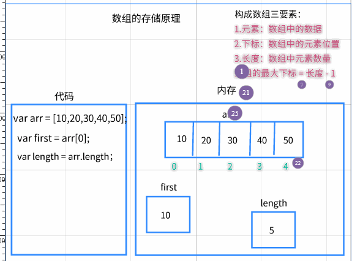
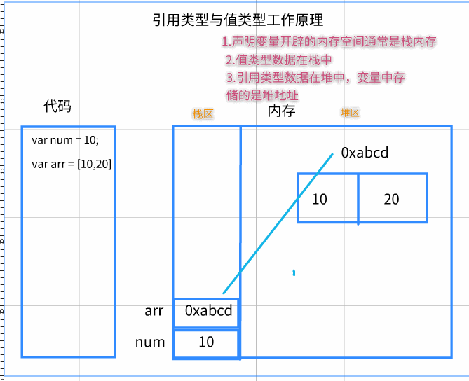
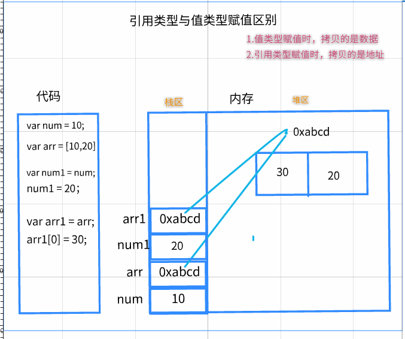

## JS三个组成部分


* `ECMAScript` - JavaScript的核心
  * ECMAScript定义了JavaScript的语言规范
  * JavaScript的核心：描述了语言的基本语法和数据类型，ECMAScript是一套标准，定义了一种语言的标准与具体实现无关
* `DOM` - 文档对象模型
  * 一套操作页面元素的API
  * DOM可以把HTML看做是文档树，通过DOM提供的API可以对树上的节点进行操作
* `BOM` - 浏览器对象模型
  * 一套操作浏览器功能的API
  * 通过BOM可以操作浏览器窗口，比如：弹出框、控制浏览器跳转、获取分辨率等

## JS三种书写位置

### JS代码三种写法

* JavaScript也有三种书写方式，并且与CSS的三种书写方式几乎一致

* 1.行内样式：不推荐，因为不便于维护
    * `<button onclick="window.alert('js行内写法')">玛卡巴卡</button>`
* 2.内部样式：写在script标签中,如果界面js代码较少可以使用，复杂的话不推荐
    * `<script >alert("这是JS内联样式")</script >`
* 3.外部样式：写在js文件中，使用script的src属性导入
    * `<script src="./01-JS外联写法.js"></script>`

### 细节注意点

* 1.无论是CSS还是JS的三种写法，当一个html文件存在多种写法时要记住HTML的代码是**从上往下解析**的
* 2.如果script标签没有src属性则表示内联样式，如果有src属性则表示外联样式，外联样式JS代码只能写在js文件中而不能写在script标签中


```html
    <!-- 2.js外部写法 -->
    <script src="./js外部.js"></script>
</head>
<body>
    <!-- 1.行内写法 -->
    <button onclick="alert('01-行内写法')">我是按钮</button>
    
    <!-- 2-内部写法  -->
    <script>
        alert('02-我是js内部写法')
    </script>
</body>
</html>

<!-- js三种书写位置(与css一致)
1.行内写法 : 写在标签行内
2.内部写法 : 写在script标签内部
3.外部写法 : 写在js外部文件中,使用script标签的src属性导入
    * 注意： 如果script标签写了src属性，就表示外部写法。此时内部的js代码不会执行。
-->
```

## JS两种注释写法

* 代码注释的作用：
    * 1.理清思路，方便自己以后阅读代码
    * 2.规范编程，方便以后别人接手代码便于维护


* JS注释有两种写法
    * `// 注释内容`:单行注释：注释内容只能是一行，适用于注释内容较少
      * vscode快捷键 CTRL + /
    * `/* 注释内容 */`:多行注释：注释内容可以是多行，适用于注释内容较多，比如一行写不下
      * vscode快捷键 ALT + SHIFT + A

```html
<script>
    //单行注释：注释内容只能是这一行
    /* 多行注释：注释内容可以是多行
    第一行
    第二行
    */
</script>
```

## 输入与输出语句

### 输出语句1 : 在网页弹出一个提示框，输出数据

```javascript
//输出语句1:弹出一个提示框，通常用于提示用户，也可以用于调试
alert("hello world");
```

### 输出语句2：在控制台打印某个数据

```javascript
//输出语句2:打印某个数据的值，查看数据是否成功
//这个写法不是给用户看的，而是给程序员自己调试看的
console.log("玛卡巴卡");
```

### 输出语句3：将数据显示到网页

```javascript
//输出语句3:将数据显示到网页，相当于给body添加内容
document.write("玛卡巴卡");
```

### 输入语句1：在网页弹出一个输入框，让用户输入数据

```javascript
//输入语句1：弹出一个输入框，可以用来输入数据
prompt("玛卡巴卡");
```

### 输入语句2：在网页弹出一个确认框，让用户输入 确认/取消 二选一

```javascript
//输入语句2：在网页弹出一个确认框，让用户输入 确认/取消 二选一
confirm("玛卡巴卡");
```


## JS代码执行原理介绍

### 1-计算机组成

* 1.软件
  * 应用软件：浏览器(chrome/ie/firefox)、QQ、Sublime、Word、webstorm
  * 系统软件：windows，Linux，unix，OSX，iOS，android
* 2.硬件
  * 三大件：CPU,内存,硬盘
  * 输入设备：鼠标,键盘,摄像头等
  * 输出设备：显示器,打印机,投影仪等


### 2-代码运行的原理


```html
<body>
    <!--

        程序运行原理：
        1.计算机将存储在硬盘中的html文件读取到内存中
        2.浏览器内核编译器开始编译代码（cpu只能处理二进制数据，需要将我们写的代码转成二进制）
        3.CPU处理与计算
        4.CPU将我们代码在运行时产生的数据保存到内存中

    -->
</body>
```

## 数据类型

### 数据类型介绍

```html
    <script>       
        /* 
        1.为什么需要有数据类型？
            * 每一种编程语言都有自己的语法规则,在处理数据的时候,也会有自己的规则,不是任何数据都可以处理的。
        2.什么是数据类型？
            * js编译器在解析代码的时候,会产生各种不同的数据。 而不同的数据'运算'与'存储'方式都不同, 计算机需要对这些数据进行分类,称之为数据类型。
        */

        console.log( '123' )//打印  黑色 123
        console.log( 123 )//打印 蓝色 123
        console.log( 'true' )//打印 黑色 true
        console.log( true )//打印 蓝色 true
        console.log( '玛卡巴卡' )//打印 玛卡巴卡
        console.log( 玛卡巴卡 )//程序报错 Uncaught ReferenceError: 玛卡巴卡 is not defined   
    </script>
```


## 五种基本数据类型

```html
    <script>

      //1. string类型 : 字符串 一切以  单引号''  双引号""  反引号``包起来的内容
      //作用 : 用于展示文本

      console.log("玛卡巴卡")
      console.log("玛卡巴卡")
      console.log(`玛卡巴卡`)
      console.log('我"爱"前端')//嵌套字符串

      //2. number类型 : 数值 一切数学中的数字。
      //作用 : 用于数学计算

      console.log(123) //整数,默认正整数
      console.log(-123) //负数
      console.log(9.9) //小数
      console.log(Infinity) //特殊数值,无穷大

      //3. boolean类型 : 布尔 只有两个值 :  true(真)  false(假)
      //作用 : 用于条件判断  true:条件成立  false:条件不成立

      console.log(true)
      console.log(false)

      //4. undefined : 未定义  只有一个值 undefined
      console.log( undefined )

      //5. null : 空值  只有一个值 null
      console.log( null )
    </script>
```

## typeof检测数据类型

```html
    <script>
        //(1) typeof 数据   (2) typeof (数据)
        //语法结果：得到一个字符串来告诉你这个数据是什么类型。 
        console.log( typeof 123 )//'number'
        console.log( typeof '123' )//'string'
        console.log( typeof true )//'boolean'
        console.log( typeof undefined )//'undefined'
        console.log( typeof null )//'object'
    </script>
```


## 变量

### 变量声明/取值/赋值

```javascript
    <script>
        
        //变量作用： 在内存中存储数据

        //1.声明变量 ： 在内存中开辟一个空间
        let age
        //2.变量赋值
        // = : 赋值运算符（把右边的数据放入左边的变量中）
        age = 18
        //3.变量取值 ： 读取变量(容器)中存储的数据
        document.write( age )

        //变量可以在声明的时候赋值
        let name = '玛卡巴卡'//等价于 (1) let name  (2)name = '玛卡巴卡'
        document.write( name )
    </script>
```


### 变量使用注意点

```html
    <script>
        /* 
        1.变量作用 ： 在内存中存储数据
        
        2.变量语法：
            2.1 声明变量 ：   let 变量名;
            2.2 变量赋值 :    变量名 = 值;
            2.3 变量取值 :    变量名

        3.变量使用注意点：
            3.1 变量不能重复声明，程序会报错
            3.2 变量重复赋值，会先销毁旧值，然后存入新值
            3.3 一个变量 赋值给 另一个变量，会将自己的数据拷贝一份然后赋值
        */

        //声明变量并且赋值
        let num1 = 10;

        /* 注意点1 ： 变量不能重复声明，否则程序会报错 */
        // let num1 = 20;

        /* 注意点2 ： 变量重复赋值，会先销毁旧值，然后存入新值 */
        num1 = 20;

        /* 注意点3 ： 一个变量 赋值给 另一个变量，会将自己的数据拷贝一份然后赋值 */
        let num2 = num1;

        console.log(num1,num2);
        
    </script>
```


### 变量命名规则与规范


```html
<script>
    /* 
        1.变量(letiable)作用 ： 在内存中 存储数据

        2.变量语法
            a. 声明变量  ：  let 变量名;
            b. 变量赋值  ：  变量名 = 值
            c. 变量取值  :   变量名 

        2.变量补充说明
            a. 变量初始化
                语法： let 变量名 = 值;
            b. let变量 不允许重复声明
            c. 变量重新赋值
                语法 : 变量名 = 值;
                特点 : 先销毁旧值，然后存入新值
            d. 变量的值是另一个变量
                语法 : 变量名a = 变量名b
                特点 : 将变量b中的数据， 拷贝一份赋值给a

        3.变量命名规则
            * 3.1规则：必须要遵守，否则会报错。由语法决定
                * 1.变量只能以下划线、字母、$开头，后面接任意的数字、下划线、字母、$
                * 2.不能以JS的关键字作为变量名
                * 3.js是严格区分大小写的， 例如：age与Age这是两个不同的变量名
            * 3.2规范: 大家都遵守的一种编码习惯，主要是为了提高代码的易读性
                * 1.起名要有意义，最好用英语名词作为变量名
     *          * 2.使用驼峰命名法：变量名第一个单词首字母小写，后面如果由其他单词则每一个单词的首字母大写

    */

        //存名字
        let name = '玛卡巴卡'
        //存年龄
        let age = 18
        //存性别
        let gender = '男'
        //存女朋友
        let girlFriend = '代码'

</script>
```

### 变量练习：交换两个变量的值

```html
    <script>
        //需求：交换两个变量里面的值
        
        let num1 = 10
        let num2 = 20

        //思考：能否直接交换
        // num1 = num2
        // num2 = num1
        // console.log( num1,num2)//20 20

        //正确方式：使用临时变量交换
        let temp = num1
        num1 = num2
        num2 = temp
        console.log( num1,num2 )//20 21
        
    </script>
```

## 常量

```html
    <script>
        /* 
        变量 :  值可以修改, 使用let声明
        常量 :  值不可以修改,使用const声明
            * 例如  let G = 9.8  let PI = 3.14 
        */ 
        
        //变量可以修改值
        let age = 18
        age = 19
        console.log(age)

        //常量不可以修改值
        const G = 9.8
        G = 10//程序报错
        console.log(G)
        
        
    </script>
```


## 字面量

```html
    <script>
        
        /* 
        js中的数据有两种使用方法
        第一种 :  先存入变量中, 通过变量取值语法来使用
            变量 :  指的是内存中的一块空间,里面的数据是可变的。(变量是内存空间)
        第二种 :  不存入变量中,直接拿来使用
            字面量 : 指的是一个固定的数据（字面量是数据）
        */

        // name是变量, '张三'是字面量
        let name = '张三'
        console.log( name )//变量取值,控制台打印'张三'

        console.log( '李四' )//字面量(又叫直接量)

        //字面量举例
        console.log( 123 )//数字字面量
        console.log( '123' )//字符串字面量
        console.log( true )//布尔字面量
        console.log( [10,20,30] )//数组字面量
        console.log( {name:'ikun'} )//对象字面量     
        
    </script>
```


## 运算符与表达式

### 算术运算符

```html
    <script>
      /* 
        1.运算符 : 有运算作用的符号
        2.算术运算符 : 用于 数学算术运算
            + - * / %(求模运算,相当于取余数) 
        3.表达式 : 由运算符组成的式子
        4.算术表达式 ： 由算术运算符组成的式子  例如   1+1
        重点： 任何表达式,都一定会有运算结果
      */

      //将表达式的结果存入变量
      let num = 1 + 1
      console.log(num) //2

      //直接打印表达式结果
      console.log(10 - 1) //9
      console.log(10 % 3) // 10除以3, 余数 1
    </script>
```


### 赋值运算符

```html
<script>
    /*赋值运算符 
    =  +=  -=  *=  /=   %=
    */

    //+=
    let num1 = 10;
    num1 += 10;//这行代码相当于 num1 = num1 + 10 的简写形式
    console.log ( num1 );//20
    //-=
    let num2 = 70;
    num2 -= 10; //相当于  num2 = num2 - 10;
    console.log(num2);//60
    //*=
    let num3 = 20;
    num3  *=  4;  //相当于  num3 = num3 * 4;
    console.log(num3);//80
    // /=
    let num4 = 90;
    num4 /= 3;//相当于 num4 = num4 / 3
    console.log(num4);//30

    let num5 = 10;
    num5 %= 3; // num5 = num5 % 3;
    console.log(num5);//1

</script>
```


### 自增自减运算符

```html
  <script>

    //1.自增运算符 ++
    //自增表达式:   num++
    // ++ 使用后会使得原来的变量立刻增加1
    // 自增分为前自增(++a)和后自增(a++)
    // 不同的是++a和a++所返回的值不同
    // a++ 是自增前的值 旧值
    // ++a 是自增后的值 新值

    let num1 = 10;
    num1++;//这行代码相当于 num1 = num1 + 1 的简写形式
    console.log ( num1 );//11


    //2.自减运算符 --
    //自减表达式： num--
    // -- 使用后会使得原来的变量立刻减小1
    //自减分为前自减(--a)和后自减(a--)
    //无论是--a还是a--都会使原变量立刻减少1
    //不同的是--a和a--的值不同
    //--a 是新值
    //a-- 是旧值

    let num2 = 20;
    num2--;//这行代码相当于 num2 = num2 - 1 的简写形式
    console.log ( num2 );//12
    
    

    let a = 10
        
    // let b = a++
    // console.log("a++ =", b)  //10

    let b = ++a
    // console.log("++a =", b)  //11
    // console.log(a)           //11

    let n = 5
    //            5  +  7  + 7
    let result = n++ + ++n + n

    // console.log(result)      //19

    a = 5
        
    // console.log('--a', --a)   //4
    // console.log('a--', a--)   //4    
    // console.log(a)            //3  

</script>
```


### 关系运算符

```html
<script>
    /**1.关系运算符（比较运算符）：比较两个数据之间的关系（某种条件是否成立）
        * 八种： >  >=  <  <=  ==  !=  ===全等 !== 不全等
    * 2.关系表达式：由关系运算符组成的式子    例如:  2 > 1
            * 只要是表达式，就会有运算结果
     * 3.关系表达式的结果一定是布尔类型：true代表成立，false代表不成立
     */

    //1.基本使用
    console.log ( 5 > 3 );//true  成立
    console.log ( 100 < 1 );//false 不成立

    //2.相等与不等:只比较数据的值，不比较数据的类型
    //注意：一个 = 号表示赋值运算符  两个 == 是比较运算符，它们作用不一样，不要搞混淆了
    console.log ( 1 == 1 );//true   常用
    console.log ( "1" == 1 );//true  他们的值一样，只是数据类型不一样

    //3.全等不全等： 先比较数据的值，再比较数据的类型
    console.log ( "1" === 1 );//false  两者的值虽然相等都是1，但是他们数据类型不一样，所以不成立

</script>

```


### 逻辑运算符

```html
<script>

    /* 
        0.关系运算符：某种条件的关系（成立/不成立），例如我的年龄大于你的年龄30>20
        1.逻辑运算符：多个条件之间的关系
        2.逻辑运算符只有三种
            * && :逻辑与 ，读作并且
            * || :逻辑或，读作或者
            * !  :逻辑非，读作取反
                * true（真）变false（假），false（假）变true（真）
     * 3.逻辑表达式: 表达式1 逻辑运算符 表达式2 
     */

    //1.逻辑与&&结果： 一假为假     （左右两边同时成立，才为真，否则为假）
    //表达式1    &&  表达式2       运算结果
    //真              真             真
    //真              假             假
    //假              真             假
    //假              假             假
    console.log ( 100 > 50 && 10 > 9 );//true  左右两边同时成立
    console.log ( 100 > 500 && 10 > 9 );//false   因为左边不成立

    //普通丈母娘找女婿 ：  有房 有车 有存款     三个条件都要满足，缺一不可    


    //2.逻辑或 ||结果 : 一真则真  （左右两边同时为假，才为假，否则为真）
    //表达式1    ||  表达式2    运算结果
    //真               真         真
    //真               假         真
    //假               真         真
    //假               假         假

    console.log ( 100 > 500 || 10 > 9 );//true  只要有一边为真则为真
    console.log ( 100 > 500 || 8 > 9 );//false 只有两边都不成立才为假

    //我的丈母娘找女婿 ： 要么有房 要么有车 要么有存款   三个条件满足任何一个即可
    
    //3.逻辑非！ ： 又叫做取反  真变假 假变真
    //    ！    表达式   结果
    //           假       真
    //           真       假
    let res = !false;
    console.log ( res );//true  假变真，真变假
    console.log ( ! ( 2 > 1 ) );//false     2>1的结果是true    与true相反的就是false

    //有的丈母娘找女婿 ：只要不是外地的。   `非xxxx`类似于一种否定逻辑

</script>
</html>
```


### 运算符优先级


* 实际开发中，我们不需要刻意去记忆运算符优先级。你想让哪个式子先计算，使用小括号 () 包起来即可


)


## 综合案例：订单信息管理


```html
<!DOCTYPE html>
<html lang="en">
  <head>
    <meta charset="UTF-8" />
    <meta name="viewport" content="width=device-width, initial-scale=1.0" />
    <meta http-equiv="X-UA-Compatible" content="ie=edge" />
    <title>Document</title>
    <style>
        table{
            margin: 20px auto;
            /* 合并边框 */
            border-collapse: collapse;
            text-align: center;
        }

        table,th,td{
            border: 1px solid #000
        }
    </style>
  </head>
  <body>
    <script>

      //1.输入4个数据：商品名称、 数量、 价格 、 地址
      let name = prompt('请输入名称')
      let count = prompt('请输入数量')
      let price = prompt('请输入价格')
      let address = prompt('请输入地址')
      console.log(name,count, price, address)

      //2.计算总价格 = 数量 * 价格
      let total = count * price

      //3.在页面输出表单
      document.write(`<table>
           <thead>
                <th>商品名称</th>
                <th>商品价格</th>
                <th>商品数量</th>
                <th>总价</th>
                <th>收货地址</th>
            </thead> 
            <tr>
                <td>${name}</td>
                <td>${price}</td>
                <td>${count}</td>
                <td>${total}</td>
                <td>${address}</td>
            </tr>
      </table>`)

    </script>
  </body>
</html>

```

## 数据类型转换

### 数据类型转换介绍

```html
    <script>
        /*       * 数据类型不一致,得不到预期计算结果
        */

        //需求：让用户输入两个数字，然后相加，打印结果
        let num1 = prompt('请输入第一个数字')
        let num2 = prompt('请输入第二个数字')
        
        let res = num1 + num2//'10' + '20'
        console.log( res )//'1020'
    </script>
```


### 转换为number类型

```html
    <script>
        //需求 ： 输入两个数字，计算两个数字的和
        // prompt输入框 得到的是string类型
        // var num1 = +prompt('请输入第一个数字');
        // var num2 = +prompt('请输入第二个数字');
        // console.log(num1,num2);
        // console.log(typeof num1,typeof num2);

        // var res = parseInt(num1) + parseInt(num2);
        // console.log(res);

        //

        /*  1.其他数据类型 转 Number
                语义明确（提高代码阅读性）
                parseInt() : 转换整数
                parseFloat() :转换小数
                Number() : 其他数据类型转数字 （boolean，undefined，null）

            2.注意点： 数据类型转换并没有改变原有变量的值，而是产生一个新的值
         */

        //1. parseInt() : 转换整数
        // 从左往右依次解析字符，遇到非数字字符停止解析，并且返回解析好的整数
        var str = '10';
        var num = parseInt(str);
        console.log(num);// 10
        console.log(str);// '10'   类型转换不改变原有变量的值，而是产生一个新的值
        
        console.log(typeof num);
        console.log(parseInt('123.1.1a'));//123
        

        //2.parseFloat() : 转换小数
        //解析规则与parseInt一致，唯一的区别就是可以识别第一个小数点
        var str = '5';
        var num = parseFloat(str);
        console.log(num);
        console.log(parseFloat('123.1.1a'));//123.1

        //3. Number() : 其他数据类型转数字
        /* 
        a. 可以解析整数和小数
        b. 只要有任意非数字字符得到NaN
         */
        console.log(Number('6'));
        console.log(Number('6.6'));
        console.log(Number('123.1.a'));
        

        //布尔类型转数字会得到0false和1 true

        console.log(Number(true));//1
        console.log(Number(false));//0

        console.log(Number(undefined));//NaN
        console.log(Number(null));//0
               
    </script>
```


### number类型特殊值NaN

```html
    <script>
        //1.NaN是number类型中一个特殊值
        // not a number:不是一个数字，表示错误的运算结果

        console.log('小王-100')//NaN
        console.log( Number('玛卡巴卡') )//NaN

        //2.NaN不能参与任何计算，结果一律为NaN
        //NaN实际场景： 开发中，我们一般不会接触到NaN，除非你的代码出bug了，数学计算出错
        let num
        console.log( num + 1 )//我们忘记给num赋值，导致undefined 与 1 相加得到NaN
        
    </script>
```


### 转换为string类型

```html
    <script>
        let num = 200
        
        //1. String(数据)
        console.log( String(num) )//'200'
        console.log( String(true) )//'true'
        console.log( String(undefined) )//'undefined'
        console.log( String(null) )//'null'

        //2. 变量名.toString()
        /* a. 如果是undefined与null，这种方式会报错 
           b. 这种方式可以支持进制转换。 例如把 十进制转十六进制
        */
        console.log( num.toString() )//'200'
        console.log( num.toString(16) )//'c8'
              
    </script>
```


### 转换为boolean类型==

```html
    <script>
        // Boolean(数据)
        /* 
        1.false： 有7种数据会得到false 
            0 -0 NaN  ''  undefined  null  false
        2.true:  除false 7种之外的一切数据
        */    

        console.log( Boolean(0) )//false
        console.log( Boolean(-0) )//false
        console.log( Boolean(NaN) )//false
        console.log( Boolean('') )//false
        console.log( Boolean(undefined) )//false
        console.log( Boolean(null) )//false
        console.log( Boolean(false) )//false

    </script>
```


### 隐式转换

```html
    <script>
       /* 
       隐式转换 ： 当运算符两边的 ‘数据类型不一致’ 的时候，编译器会转成一致后运算
            (1)转换数字 ： 算术运算符 + - * / %
            (2)转换字符串 ： 连接符+  (+号两边只要有一边是字符串，此时+就是连接符)
            (3)转换布尔: 逻辑非 !    
       */     
       
       //1.转换数字 : 算术运算符
       console.log( '100' - 10 )//90  Number('100') - 10
       console.log( 1 + true )//2  1 + Number(true)
       console.log( +'10' )//10  +数学正号 Number(10)  
       
       //2.转换字符串 : 连接符
       console.log( '1' + true )//'1true'  '1' + String('true')

       //3.转换布尔 : !
       console.log( !1 )//false   !Boolean(1)
       console.log( !undefined )//true   !Boolean(undefined)
       
    </script>
```


### undefined与null区别

```html
    <script>
        /* 
        1. undefined : 未定义。 当变量只声明,但是没有赋值。此时默认值是undefined
            * 说人话 : undefined相当于期房。 买了房,但是房子还没建出来。(未定义)

        2. null : 有定义。 定义的值是空值。
            * 说人话 ： null相当于毛坯房。买了房,但是房子没住人,里面是空的。(空值)
        */  
       
        //相同点 : (1)值相等 (2)转布尔类型都是false
        console.log( undefined == null )//true
        console.log( Boolean(undefined) )//false
        console.log( Boolean(null) )//false

        //不同点 : (1)数据类型不同  (2)转number类型值不同
        console.log( undefined === null )//false
        console.log( Number(undefined) )//NaN
        console.log( Number(null) )//0
        
    </script>
```


## 流程控制-分支语句

### 语句与表达式

```html

    <script>
        /* 
            简单概括: 有运算符参与的就是表达式,没有运算符参与的就是语句
        */
        
        //1.表达式 : 由运算符组成的式子, 一定会有运算结果 (运算)
        1+1
        10 > 9
        //2.语句 : 让js编译器执行某个命令,做什么事情 (执行)
        //分支语句  循环语句

    </script>
```


### if单分支结构

* 1.if结构语法：**if(条件 true/false){ 条件成立时需要执行的代码 }**
* 2.if结构补充说明：
  * 1.大括号中可以是任何代码，不限数量
  * 2.如果大括号中代码有且只有一行，则可以省略大括号。这种写法代码不规范，不是老司机的作风
* 3.注意点:小括号中的条件可以是哪些呢
  * (1)关系表达式：结果一定是布尔类型
  * (2)布尔类型的值：true和false
  * (3)其他表达式和值：都会先转换成布尔类型再判断真和假

```javascript
    <script>
      //1.顺序结构(默认) ： 代码从上往下依次执行
    //   console.log('1-我今天上学了')
    //   console.log('2-我今天考试了')
    //   console.log('3-我回家了')
    //   console.log('4-爸爸打我了')
    //   console.log('5-我回房间睡觉了')

      //2.分支结构 ： 代码根据条件来执行
      /* 
        语法
            if(条件 true/false){
                满足条件需要执行的代码
            }

        注意点： 小括号里面的条件可以写哪些代码呢？
            (1)比较表达式 ： 比较表达式结果一定是布尔类型
            (2)直接写布尔类型的值
            (3)写其他的值 ： 编译器会自动转成布尔类型来判断是否成立
        */

      //需求：考试不及格爸爸才打我
      let score = 59

      console.log('1-我今天上学了')
      console.log('2-我今天考试了')
      console.log('3-我回家了')
      if( score < 60 ){
        console.log('4-爸爸打我了')
      }
      console.log('5-我回房间睡觉了')

      if( 1 ){//Boolean(1) = true
          console.log('满足条件，成立')
      }

    </script>
```

### if-else双分支结构

```javascript
if（条件）{
    条件成立时需要执行的代码
}else{
    条件不成立时需要执行的代码
}
```

* 1.if-esle结构语法:用于两种互斥的条件判断
  * 例如：如果(if)我的钱超过100块就洗脚(也就是说钱>=100)，否则(else)不洗脚（也就是说钱<100）
* 2.if-else结构注意点
  * **if大括号中的代码与else大括号的代码只会执行一个，不会同时执行**
* **if-else语句的作用主要就是为了提高代码的运行效率,虽然可以用两个if语句来代替if-else语句，但是两个if语句需要判断两次，而if-else只需要判断一次**

```html
    <script>
       /* 
       if-else双分支
       语法：
        if(条件true/false){
            条件成立时需要执行的代码
        }else{
            条件不成立时需要执行的代码
        }

        注意点：双分支语句是两个互斥条件(两个条件一定会满足一个，不会同时满足，也不会同时不满足)
            if大括号代码 和 else大括号代码 一定会执行一个,不会同时执行，也不会同时不执行
       */ 


      //需求：(1)考试不及格爸爸才打我 (2)考试及格，爸爸给我买奥迪
      let score = 89

      console.log('1-我今天上学了')
      console.log('2-我今天考试了')
      console.log('3-我回家了')
      if(score < 60 ){
        console.log('4-爸爸打我了')
      }else{
        console.log('4-爸爸给我买玛卡巴卡')
      }
      console.log('5-我回房间睡觉了')

      /* 互斥条件：两个条件一定会满足一个，不会同时满足，也不会同时不满足 */
      if(1){
        console.log('世界上最遥远的距离不是生与死距离，而是我在if里，你在else里。看起来隔得那么近，却永远也无法一起执行');
      }else{
        console.log('我爱你');
      }
    </script>
```


### if-else if-else多分支结构

* 1.if-else if-else结构语法：

```javascript
if(条件1){
    条件1成立时需要执行的代码
}else if(条件2){
    条件2成立时需要执行的代码
}else if(条件3){
    条件3成立时需要执行的代码
}else{
    以上所有条件都不成立时需要执行的代码
}
```

* 2.注意点：
  * (1) if-else if -else结构中必须以if开头，中间的else if可以是多个，末尾的esle可以省略（一般都不会省略）
  * **(2)if-else if-else语句中所有的大括号中的代码只会执行其中一个，不会执行多个**

```html
    <script>
      /* 
        if分支语句
            单个条件: if单分支
            两个条件: if-else双分支
            多个条件： if - else if - else 多分支

        语法
            if(条件1){
                条件1成立时需要执行的代码
            }else if(条件2){
                条件2成立时需要执行的代码
            }else if(条件3){
                条件2成立时需要执行的代码
            }
            .....
            else{
                如果前面所有条件都不满足，则执行else代码
            }
        注意点
            (1)多分支所有的大括号代码最多只会执行一个，只有当前面的条件不满足，才会进入后面的条件判断
            (2)多分支一定要以if开头，后面else if可以多个，结尾else可以省略
        */

      //需求  (1)90以上，买布加迪  (2)80-90,兰博基尼  (3)60-80,特斯拉 (4)不及格，打我一顿
      let score = 58

      console.log('1-我今天上学了')
      console.log('2-我今天考试了')
      console.log('3-我回家了')

      if (score >= 90) {
        console.log('4-爸爸给你买布加迪')
      } else if (score >= 80) {//隐藏条件score < 90
        console.log('4-爸爸给你买兰博基尼')
      } else if (score >= 60) {//隐藏条件score<80
        console.log('4-爸爸给你买特斯拉')
      }else{//隐藏条件 score<60
        console.log('4-爸爸打我一顿')
      }

      console.log('5-我回房间睡觉了')
    </script>
```

### switch-case分支结构

* 1.语法

```javascript
switch(表达式){
    case 值1:
        表达式的结果 === 值1，需要执行的代码
        break;
    case 值2:
        表达式的结果 === 值2，需要执行的代码
        break;
    case 值3：
        表达式的结果 === 值3，需要执行的代码
        break;
    .......
    default:
        表达式的结果和上面所有的case后面的值都不全等，则会执行这里的代码
        break;
}
```

* 2.注意事项
  * 1.表达式的结果要和值一定是全等的关系===
  * 2.break作用：结束该switch语句，所以一般情况下要加上，如果不加上则会发生穿透
    * 穿透：从上一个case代码快执行到下一个case代码快
    * break关键字的作用就是防止穿透
  * 3.default语句可以写在任何地方，也可以省略，但是一般写在最后，这是一种代码规范

```html
    <script>
      /* 
        switch-case分支结构

        语法：
            switch(匹配值){
                case 值1 :
                    值1 === 匹配值,需要执行的代码
                    break
                case 值2 :
                    值2 === 匹配值,需要执行的代码
                    break
                ......
                default :
                    匹配值与上面所有case的值不匹配(全等)，需要执行的代码
                    break
            }

        注意点
            (1)匹配值和case值 一定要是 ‘全等’关系
            (2)不能省略break关键字,break关键字作用是结束switch语句
                如果省略则会发生传统现象： 代码从上一个case无条件执行到下一个case
        */

      //需求：弹出一个输入框让用户选择方向
      let subject = +prompt(
        '请输入您想要选择的方向 1-摆烂  2-学习 3-睡觉 4-搬砖'
      )

      switch (subject) {
        case 1:
          document.write('恭喜你选择摆烂 开摆')
          break
        case 2:
          document.write('恭喜你选择学习 开学')
          break
        case 3:
          document.write('恭喜你选择睡觉 睡')
          break
        case 4:
          document.write('恭喜你选择搬砖 快搬')
          break
        default:
          document.write('找事是吧')
          break
      }
    </script>
```

### switch-case穿透用法

* 合理穿透：多种值需要执行相同代码

```html
<script>
    /**合理穿透：当存在多种值需要执行相同代码时使用穿透可以节省代码
     * 用户输入某一个月份，告诉用户这个月份属于什么季节
     * 12，1，2 冬季
     * 3，4，5 春季
     * 6，7，8 夏季
     * 9，10，11 秋季
     */
    let month = +prompt("请输入月份");
    switch (month){
        case 12:
        case 1:
        case 2:
            alert("冬季");
            break;
        case 3:
        case 4:
        case 5:
            alert("春季");
            break;
        case 6:
        case 7:
        case 8:
            alert("夏季");
            break;
        case 9:
        case 10:
        case 11:
            alert("秋季");
            break;
        default:
            alert("你来自火星吧？");
            break;
    }

</script>
```


## 代码断点调试使用


## 三元表达式

* 1.运算符根据参与运算的值数量分为一元、二元、三元运算符
  * 一元运算符：只能操作一个值 ++ -- ！
  * 二元运算符：操作两个值 1 + 1 1 > 0
  * 三元运算符：操作三个值
* 2.三元运算符语法
  * 三元运算符： `?:`
  * 三元表达式：`表达式?代码1：代码2`
    * 1.如果表达式成立则执行代码1，否则执行代码2
* 2.如果代码1或者代码2有运算结果则三元运算式的结果就是他们其中的一个
  * 三元运算符做的事和if-else类似，只是代码更简洁

```html
    <script>
        /* 
        1.运算符根据运算数的多少，分为一元、二元、三元运算符
            一元运算符：只能运算一个数    
                ++ -- !
            二元运算符：能运算两个数
                算术、比较
            三元运算符： 能运算三个数
                ?:
        2.三元表达式: 表达式 ? 代码1 : 代码2
            执行规则: 如果表达式为true,则执行代码1，否则执行代码2
        3.三元表达式功能和if-else语句类似
            3.1 如果你的代码只有1行，则可以用三元
            3.2 三元表达式有运算结果
        */    

        //如果代码1 和 代码2 不能产生结果，则三元表达式的结果是undefined
        let res =  1>0 ? alert('哈哈') : alert('呵呵')
        console.log( res )//undefined

        //如果代码1 和 代码2 有结果，则三元表达式的结果就是他们的结果
        let res1 = true ? 10 : 20
        console.log( res1 )

    </script>
```


## 随堂练习：判断平年与闰年

```html
    <script>
        /* 本练习考察知识点: 双分支语句 + 逻辑运算符 */


        //需求： 用户输入年份，如果是平年则页面显示：平年，否则页面显示：闰年
         
        //(1)用户输入年份
        let year = +prompt('请输入年份')
        //(2)闰年： 能被400整除  或  能被4整除且不能被100整除
        if( (year % 400 === 0) || (year % 4 === 0 && year % 100 !== 0) ){
            document.write( '闰年' )
        }else{
            document.write( '平年' )
        }
        
    </script>
```


## 随堂练习：求两个数字最大值

```html

    <script>
        /* 本案例考察知识点： 三元运算符、隐式类型转换 */

        //需求：(1)让用户输入两个数字  (2)比较两个数字大小,并在页面显示最大的那个数字
        
        //1.用户输入两个数
        let num1 = +prompt('请输入第一个数')
        let num2 = +prompt('请输入第二个数')

        //2.比较大小
        let res =  num1 >= num2 ? num1 : num2
        document.write(`最大的数字是:${res}`)
                
    </script>
```


## 随堂练习：数字补0

```html
    <script>
        /* 本案例考察知识点：(1)三元运算符  (2)字符串拼接 */

        //需求：让用户输入一个数字, 如果数字大于10则直接页面打印这个数字，否则在数字页面补上0之后在页面打印结果。  例如:输入10就打印10, 如果5就打印05

        //1.用户输入1个数    
        let num = +prompt('请输入一个数字')
        let res = num >= 10 ? num : '0' + num
        document.write(res)
    </script>
```


## 流程控制-循环语句

### while循环

```html
    <script>
      //打印3次玛卡巴卡
      //复制粘贴弊端：(1)代码冗余 (2)维护不便
      // console.log( '玛卡巴卡' )
      // console.log( '玛卡巴卡' )
      // console.log( '玛卡巴卡' )

      /*循环结构：代码重复执行

        while循环语法 
            while( 条件 true/false ){
                循环体：需要重复执行的代码
            }

        执行规则
            1.判断条件是否成立
                1.1 true : 则执行循环体代码
                1.2 false : 循环结束，执行大括号后面的代码
            2.重复步骤1
        */

      //1.声明变量记录循环次数(循环变量)
      let num = 1
      //2.循环条件
      while (num <= 10) {
        console.log("玛卡巴卡")
        //3.循环变量自增
        num++
      }

      console.log("结束")
    </script>
```


### for循环

```html
    <script>
        /* 
        for循环： 1.声明循环变量  2.循环条件  3.循环变量自增 写在一个小括号中，代码更加简洁易读
        语法：
            for(语句1;语句2;语句3){
                循环体：需要重复执行的代码
            }
        
        执行规则
            1. 执行语句1(声明循环变量)
            2. 判断语句2结果是否成立(循环条件)
                2.1 true : 执行循环体
                    * 2.1.1 执行语句3(循环变量自增)
                2.2 false: 循环结束，执行大括号后面的代码
            3. 重复步骤2

         */

         for(let i = 1; i <= 3;i++){
             console.log('玛卡巴卡')
         }

         console.log('结束')
         
    </script>
```


### break与continue关键字

```html
    <script>
      /* 
      continue : 结束本次循环体，立即进入下一次循环判断
        * continue关键字只能用于循环语句
      break:     结束整个循环语句，立即执行大括号后面的代码
        * break关键字可以用于 循环语句 + switch-case
      */

      //模拟吃10个饺子
      for (let i = 1; i <= 10; i++) {
        //continue : 吃到第五个饺子，发现虫子。 第五个饺子不吃，但是没吃饱后面饺子继续吃
        // if( i === 5 ){
        //     continue
        // }

        //break : 吃到第五个饺子，吃饱了。 后面的饺子不吃了。
        if (i === 5) {
          break
        }
        document.write(`<p>我正在吃第${i}个饺子</p>`)
      }
    </script>
```


## 随堂练习：while循环

```html
    <script>
        /* 本案例主要让学生了解while循环适用场景 及 对应 用法
            (1)while循环适用于 循环次数不明确
            (2)写while循环要学会分析： 循环条件、循环体
            (3)while循环 一般会使用 break 关键字来跳出循环
        */    

        //需求：  (1)弹出一个确认框询问：'我爱你,嫁给我好吗'
        // (2)如果用户选择是,则跳出循环并弹窗:'我们结婚吧' , 否则继续询问
        
        let res = confirm('我爱你,嫁给我好吗')
        while( !res ){
            res = confirm('我爱你,嫁给我好吗')
        }

        alert('我们结婚吧')
    </script>
```


## 随堂练习：登录验证

```html
    <script>
        /* 本案例主要让学生了解while循环适用场景 及 对应 用法
            (1)while循环适用于 循环次数不明确
            (2)写while循环要学会分析： 循环条件、循环体
            (3)while循环 一般会使用 break 关键字来跳出循环
        */    

        //需求：  (1)让用户输入 用户名 和 密码
        // (2)如果 用户为admin 并且 密码为123456,则跳出循环弹窗提示登录成功,否则让用户继续登录
        
        let username = prompt('请输入用户名')
        let password = prompt('请输入密码')

        while( username != 'admin' || password != '123456' ){
            username = prompt('请输入用户名')
            password = prompt('请输入密码')
        }

        alert('登录成功')
    </script>
```


## 随堂练习：打印1-100所有整数

```html
    <script>
      /* 本案例主要让学生了解 for 循环适用场景 及 对应 用法
            (1)for循环适用于 循环次数明确
            (2)写for循环要学会分析： 循环条件、循环体、循环变量
        */

      //需求：  打印 1-100所有整数

      for (let i = 1; i <= 100; i++) {
        console.log(i)
      }
    </script>
```


## 随堂练习：打印1-100所有偶数

```html
    <script>
      /* 本案例思路在开发中很常见，叫做筛选 ： 找出一组数据中,符合条件的数据 
      (1)先遍历(循环)每一个数据
      (2)找出符合条件的数据
      */

      //需求：  打印 1-100 所有 偶数

      for (let i = 1; i <= 100; i++) {
        if (i % 2 == 0) {
          console.log(i)
        }
      }
    </script>
```


## 综合案例：ATM取款机


```html
    <script>
      /* 
        需求：用户可以选择1-存钱、2-取钱、3-查看余额和4-退出功能
        思路分析：
            (1)存钱 ： 数学加法
            (2)取钱 ： 数学减法
            (3)查看余额 ： 变量存储数据
            (4)退出功能 : 结束循环 break
        */

      //1.声明变量存储银行余额 和 用户操作
      let money = 1000
      let caozuo = null
      //2.写循环
      while (caozuo !== 4) {
        //用户输入
        caozuo = +prompt('请输入您的操作 1-存钱  2-取钱  3-查看余额  4-退出')
        //用户操作是一个固定值匹配，这里使用switch-case更好
        switch (caozuo) {
          case 1:
            let num1 = +prompt('请输入您想要存多少钱')
            money += num1
            break
          case 2:
            let num2 = +prompt('请输入您想要取多少钱')
            money -= num2
            break
          case 3:
            alert(`您当前的余额是：${money}`)
            break
          case 4:  
            break
          default:
              alert('暂时不支持这个功能')
              break
        }
      }
    </script>
```


## 循环嵌套

### 循环嵌套介绍

```html
    <script>
      
      /* 
      循环嵌套(双重循环) :  循环里面 嵌套 一个循环
      举例： 打印 4行5列星星,一次只能打印一个
      ☆ ☆ ☆ ☆ ☆
      ☆ ☆ ☆ ☆ ☆
      ☆ ☆ ☆ ☆ ☆
      ☆ ☆ ☆ ☆ ☆
      */

      //外层循环:行数
      for (let i = 1; i <= 4; i++) {
        //内层循环:列数
        for(let j = 1;j <= 5;j++){
            document.write('☆ ')
        }
        document.write('<br>')
      }
    </script>
```


### 循环嵌套三角形星星

```html
    <script>
        /* 需求：打印一个三角形星星
        ☆
        ☆ ☆
        ☆ ☆ ☆
        ☆ ☆ ☆ ☆
        ☆ ☆ ☆ ☆ ☆
        */

        /* 
        i 外层循环行数 : 1 2 3 4 5
        j 内层循环列数 :
            当i为1,  打印1列
            当i为2,  打印2列
            当i为3,  打印3列
            当i为4,  打印4列
            当i为5,  打印5列
        */   
        //外层
        for(let i = 1;i<=5;i++){
            //内层
            for(let j = 1;j <= i;j++){
                document.write('☆ ')
            }
            document.write('<br>')
        }
    </script>
```


### 循环嵌套：九九乘法表


```html
<!DOCTYPE html>
<html lang="en">
<head>
    <meta charset="UTF-8">
    <meta name="viewport" content="width=device-width, initial-scale=1.0">
    <meta http-equiv="X-UA-Compatible" content="ie=edge">
    <title>Document</title>
    <style>
        span{
            display: inline-block;
            width: 100px;
            height: 40px;
            text-align: center;
            line-height: 40px;
            border: 1px solid green;
            margin: 2px;
        }
    </style>
</head>
<body>
    <script>
        /* 
        外层循环： i = 9 行
        内层循环 : j <= j 列  
        */    
       for(let i = 1;i <= 9;i++){
            for(let j = 1;j <= i;j++){
                document.write(`<span>${j}*${i}=${i*j}</span>`)
            }
            document.write('<br>')
       }
    </script>
</body>
</html>
```


## 数组类型




### 数组介绍

```html
    <script>
        /* 本小节为数组原理讲解,不需要学生敲代码
        1.数组是什么？ : 是一种复杂数据类型
        2.数组作用？ : 可以在变量中 ‘存储多个数据’
        3.数组内存原理？ : 数组内存由三个部分组成(数组三要素)
            元素: 数组中的数据
            下标: 元素的位置
            长度: 元素的数量
         */

        //需求：存储 五个人名字
        //弊端：（1）代码冗余 （2）维护不便
        // let s1 = '小明'
        // let s2 = '小刚'
        // let s3 = '小花'
        // let s4 = '小美'
        // let s5 = '小白'

        //使用数组： 一个变量存储多个数据
        let array = ['小明','小刚','小花','小美','小白']

        console.log( array )
        
    </script>
```


### 数组语法

```html
    <script>
        /* 
        1.数组声明：  let  数组名 = [元素1,元素2,元素3,.......]
        2.数组取值    数组名[下标]
        3.数组长度    数组名.length
        */

        //1.声明数组    let 数组名 = [数据1,数据2,数据3,.....]
        let names = ['小明','小刚','小花','小美','小白']
        //2.数组取值   数组名[下标]
        console.log( names )//['小明', '小刚', '小花', '小美', '小白']
        console.log( names[0] )//小明
        //3.数组长度   数组名.length
        console.log(names.length)//5
    </script>
```


### 数组遍历

```html
    <script>
        /* 
        1.数组语法
            (1).数组声明：  let  数组名 = [元素1,元素2,元素3,.......]
            (2).数组取值    数组名[下标]
            (3).数组长度    数组名.length
        2.数组遍历： 依次读取数组每一个元素值
            固定格式的for循环:  
                for(let i = 0;i < arr.length ;i++){
                    arr[i]
                }
         */

        let names = ['小明','小刚','小花','小美','小白','小彪']

        //遍历数组： for循环
        for(let i = 0;i < names.length;i++ ){
            console.log( names[i] )
        }   
        // console.log( names[0] )
        // console.log( names[1] )
        // console.log( names[2] )
        // console.log( names[3] )
        // console.log( names[4] )
        
    </script>
```


## 数组操作(增删改查)


### 查询与修改元素

```html
    <script>
        /* 
        1.声明数组  let 数组名 = [元素1,元素2,元素3,....]
        2.数组取值(查)    数组名[下标]
        3.数组赋值(改)    数组名[下标] = 值
        */    

        let arr = [ 20,66,88,50,100 ]
        
        /*数组取值 
        (1)如果下标存在，则会获取元素值
        (2)如果下标不存在，则会获取undefined
        */
        console.log( arr[2] )//88
        console.log( arr[6] )//undefined

        /*数组赋值 
        (1)如果下标存在，则获修改元素值
        (2)如果下标不存在，
        */
       arr[0] = 99//修改0下标元素值
       arr[6] = 70//动态新增一个元素
       console.log(arr)
        
    </script>
```


### 新增元素(push与unshift)

```html
    <script>
        /*数组新增有两个方法
        
        数组名.push(元素)  : 一个或多个元素,添加到末尾
        数组名.unshift(元素)  : 一个或多个元素,添加到开头
        
        */
        let arr = [20,50,88,60,100]
        //1. 添加到末尾
        arr.push(90,200)
        console.log(arr)
        //2. 添加到开头
        arr.unshift(5,8)
        console.log(arr)
        
        

    </script>
```


### 删除元素(pop与shift)

```html
    <script>
        let arr = [10,20,30,40,50]
        
        //1.删除最后一个元素  arr.pop()
        arr.pop()
        console.log(arr)

        //2删除第一个元素  arr.shift()
        arr.shift()
        console.log( arr )
           
    </script>
```


### 删除指定元素

```html
    <script>
        let arr = [10,20,30,40,50]
        
        /* 
        arr.splice(start,deleteCount)
            第一个值： 起实位置。 从0开始
            第二个值： 要删除的数量
                * 如果没有指定数量，则会删除从起始位置到后面所有元素
        */
        arr.splice(1,2)//表示从下标1开始，往后删除2个元素.把20，30给删除了
        console.log(arr)//[10,40,50]
        
    </script>
```


## 数组应用

### 数组求和

```html
    <script>
      /* 本案例思路在开发中很常见，叫做累加和 : 求一组数据的 总和 
      (1)声明一个变量存储结果
      (2)遍历数组中每一个元素
      (3)累加
      */
      let arr = [20, 50, 66, 88, 70]

      //1.声明空变量存储结果
      let sum = 0
      //2.遍历数组
      for (let i = 0; i < arr.length; i++) {
        console.log(arr[i])
        //3.累加
        sum += arr[i]
      }

      console.log(sum, sum / arr.length)
    </script>
```

### 求数组最大元素与最小元素

```html
    <script>
        /*求数组最大值
        1.声明变量默认为第一个元素
        2.遍历数组
        3.依次比较大小，然后赋值
        */
        let arr = [20,50,66,88,70]    

        //1.声明变量默认为第一个元素
        let max = arr[0]
        //2.遍历数组
        for(let i = 1;i < arr.length;i++){
            console.log( arr[i] )
            //3.比较大小，然后赋值
            if( arr[i] > max){
                max = arr[i]
            } 
        }

        console.log(max)
    </script>
```


### 筛选数组

```html

    <script>
        //需求：将数组 [2, 0, 6, 1, 77, 0, 52, 0, 25, 7] 中大于等于 10 的元素选出来，放入新数组

        /* 
        1.找出指定范围符合条件的数
        2.把符合条件的数放入新数组中（新增元素）
        */
        

        let arr = [2, 0, 6, 1, 77, 0, 52, 0, 25, 7]
        //1.声明空数组
        let newArr = []
        //2.遍历旧数组，找出符合条件的数
        for(let i = 0;i<arr.length;i++){
            if( arr[i] >= 10 ){
                //3.添加到新数组中
                console.log(arr[i])
                newArr.push( arr[i] )
            }   
        }

        console.log( newArr )
            
    </script>

```

### 数组去0

```html
    <script>
      //需求：将数组 [2, 0, 6, 1, 77, 0, 52, 0, 25, 7] 中的 0 去掉后，形成一个不包含 0 的新数组

      /*实际开发场景：去除数组中指定的元素，生成新数组
            (1)微信账单： 收入 + 支出。  需求是只看收入(支出类型去除)
            (2)商品列表 ： 京东自营(把非自营商品去除)
        */

      let arr = [2, 0, 6, 1, 77, 0, 52, 0, 25, 7]
      //1.声明空数组存储结果
      let newArr = []
      //2.遍历数组，找出不为0的元素
      for (let i = 0; i < arr.length; i++) {
        if (arr[i] !== 0) {
          console.log(arr[i])
          //3.新增到空数组
          newArr.push(arr[i])
        }
      }

      console.log(newArr)
    </script>
```


### 根据数组生成柱状图


```html
<!DOCTYPE html>
<html lang="en">
  <head>
    <meta charset="UTF-8" />
    <meta name="viewport" content="width=device-width, initial-scale=1.0" />
    <meta http-equiv="X-UA-Compatible" content="ie=edge" />
    <title>Document</title>
    <style>
      .box {
        width: 800px;
        height: 400px;
        margin: 50px auto;
        border-left: 1px solid #000;
        border-bottom: 1px solid #000;
        display: flex;
        justify-content: space-around;
        align-items: flex-end;
        text-align: center;
      }

      .box > div {
        width: 50px;
        height: 100px;
        background-color: pink;
        display: flex;
        /* 修改主轴方向为垂直方向 */
        flex-direction: column;
        /* 主轴对齐方式 */
        justify-content: space-between;
      }

      .box > div > span {
        margin-top: -20px;
      }

      .box > div > h4 {
        margin-bottom: -25px;
      }
    </style>
  </head>
  <body>
    <!-- <div class="box">
      <div>
        <span>50</span>
        <h4>1季度</h4>
      </div>
      <div>
        <span>50</span>
        <h4>2季度</h4>
      </div>
      <div>
        <span>50</span>
        <h4>3季度</h4>
      </div>
      <div>
        <span>50</span>
        <h4>4季度</h4>
      </div>
    </div> -->

    <script>
      /*需求 
        (1)让用户输入四个季度数据，存入数组中
        (2)根据数组中的数据，生成页面柱状图
        */

      //声明一个数组存储数据
      let arr = []

      //1.for循环输入4次
      for (let i = 1; i <= 4; i++) {
        let num = +prompt(`请输入第${i}个季度的数据`)
        console.log(num)
        //1.1 添加到数组中
        arr.push(num)
      }
      console.log(arr)

      //2.根据数组中的数据，生成页面柱状图
      let str = ''
      for (let i = 0; i < arr.length; i++) {
            str += `<div style="height:${arr[i]}px">
                        <span>${arr[i]}</span>
                        <h4>${i+1}季度</h4>
                    </div>`
      }
      console.log(str)
      //把str输出在页面
      document.write(`<div class="box">${str}</div>`)
      
    </script>
  </body>
</html>

```


### 根据数组生成手风琴盒子


```html
<!DOCTYPE html>
<html lang="en">
<head>
    <meta charset="UTF-8">
    <meta name="viewport" content="width=device-width, initial-scale=1.0">
    <meta http-equiv="X-UA-Compatible" content="ie=edge">
    <title>Document</title>
    <style>
        .box{
            width: 1120px;
            height: 260px;
            margin: 50px auto;
            display: flex;
            overflow: hidden;
        }

        .box>div{
            width: 120px;
            border: 1px solid #fff;
            transition: all 0.5s;
        }

        .box>div:hover{
            width: 400px;
        }
    </style>
</head>
<body>
    <!-- <div class="box">
        <div></div>
        <div></div>
        <div></div>
        <div></div>
        <div></div>
        <div></div>
        <div></div>
    </div> -->

    <script>
        let arr = [
            './images/1.jpg',
            './images/2.jpg',
            './images/3.jpg',
            './images/4.jpg',
            './images/5.jpg',
            './images/6.jpg',
            './images/7.jpg',
        ]

        //根据数组元素生成页面内容
        let str = ''
        //遍历数组
        for(let i = 0;i<arr.length;i++){
            str += `<div></div>`
        }
        console.log(str);
        //输出到页面
        document.write(`<div class="box">${str}</div>`)
        
    </script>
</body>
</html>
```

## 函数类型

### 函数介绍

* 1.在实际开发中，我们有很多功能代码 并`不是只执行一次`，而是`需要在很多个地方`。
  * 例如我们之前学习过的求和功能 ：购物车页面需要求和，自己的订单列表页面需要求和查看总消费，还有待付款页面等等
  * 多个地方：可以是同一个程序员好多个页面都需要使用。 也可以是不同程序员所负责的页面
* 2.那么既然是相同的功能代码，我们肯定不能复制粘贴去写冗余代码。这样万一功能有变化，维护起来就会很不方便
* 3.而函数就是解决这些重复功能的 `代码复用问题`
  * 函数是一个数据类型，可以理解为存储代码的容器。 把这些代码给存到变量中，要使用的时候取出来执行即可。

### 函数声明/调用

```html
    <script>
      /* 需求：一段代码 需要在很多个地方使用 */

      /*函数语法 
        
        1.声明函数 : 是一个存储过程，此时不会执行函数体代码  
            function 函数名(){
                函数体代码： 需要存储的一段代码
            }

        2.调用函数 ： 执行函数体代码
            函数名()
         */

      //1.声明函数 : 把代码存入容器中
      function learn() {
        console.log("1-玛卡巴卡回家了")
        console.log("2-玛卡巴卡看电视")
        console.log("3-玛卡巴卡玩游戏")
        console.log("4-玛卡巴卡睡觉了")
      }

      //2.调用函数： 执行函数体代码
      //调用者A
      learn()

      //调用者B
      learn()
    </script>
```


### 函数参数

```html
    <script>
       /*
        0.函数语法  : 函数是一种用于存储代码块的复杂数据类型
            * 作用：解决代码复用问题
        
        1.声明函数 : 声明函数只是把代码存起来，不会执行函数体  
            function 函数名(){
                函数体代码： 需要存储的一段代码
            }

        2.调用函数 ： 执行函数体代码
            函数名()

        3.函数参数 ： 调用者 传递数据 函数
            3.1 传：调用者
                函数名(实际参数)
            3.2 收：函数
                function 函数名(形式参数){   //函数体代码 }
            3.3 函数传参本质： 实参给形参赋值的过程
                (1)函数传参是按照传入顺序一一赋值
                (2)函数每一次调用传参过程都是独立的，互不影响
                (3)函数 形参数量 和 实参数量 可以不一致的
         */

      //声明函数
      function learn(name,money) {
        console.log(`1-${name}回家了`)
        console.log(`2-${name}看电视`)
        console.log(`3-${name}玩游戏`)
        console.log(`4-${name}睡觉了${money}分钟`)
      }

      //调用函数
      //调用者A
      learn('张三',8000)

      //调用者B
      learn('李四',9000)

      //调用者C
      learn('王五')//编译器底层  getSum(66,undefined)
    </script>
```

### 函数默认参数(逻辑短路运算)

```html
    <script>
      /* 
        1.函数默认参数，我们自己在开发中使用不多。（了解后面很多js框架函数默认参数底层原理）
        2.函数默认参数 使用 逻辑运算符短路运算(逻辑中断)
            2.1 短路运算： 左边式子就可以决定结果，右边式子不执行
                && : 一假则假
                || : 一真则真
                 ! : 取反(没有短路运算，因为只有一个式子)
            2.2 短路规则：
                && : 找假。  左边式子值可以转成false，则无条件返回左边式子的值，右边不执行。 反之无条件返回右边式子的值。
                || : 找真。 左边式子值可以转成true，则无条件返回左边式子的值，右边不执行。 反之无条件返回右边式子的值。 
        
        */

        let res = undefined && 20
        console.log( res )//undefined

        let res1 = undefined || 20
        console.log( res1 )//20
        
      //需求：给函数添加默认参数0
      // (1)如果用户有传递实参，就使用用户传递的实参
      // (2)如果没有传，就使用默认参数
      function getSum(num1,num2){
          num1 = num1 || 0
          num2 = num2 || 0
          console.log(num1+num2)
      }

      getSum(66)

      
    </script>
```


### 函数返回值

```html
    <script>
      /*
        0.函数语法  : 函数是一种用于存储代码块的复杂数据类型
            * 作用：解决代码复用问题
        
        1.声明函数 : 声明函数只是把代码存起来，不会执行函数体  
            function 函数名(){
                函数体代码： 需要存储的一段代码
            }

        2.调用函数 ： 执行函数体代码
            函数名()

        3.函数参数 ： 调用者 传递数据 函数
            3.1 传：调用者
                函数名(实际参数)
            3.2 收：函数
                function 函数名(形式参数){   //函数体代码 }
            3.3 函数传参本质： 实参给形参赋值的过程
                (1)函数传参是按照传入顺序一一赋值
                (2)函数每一次调用传参过程都是独立的，互不影响
                (3)函数 形参数量 和 实参数量 可以不一致的

        4.函数返回值 ： 函数 传递数据 给调用者
            4.1 传 ： 函数
                function 函数名(){ return 值 }
            4.2 收 :  调用者
                let 变量名 = 函数名()
            4.3 注意点
                (1)函数return关键字后面的代码不会执行的
                    * 只要有return关键字，函数体立即结束执行。
                (2)如果函数没有return，则默认返回值是undefined
        */

        
        //写一个函数，求数组的和
        //声明函数    
        function getSum(arr){
            let sum = 0
            for(let i =0;i<arr.length;i++){
                sum += arr[i]
            }
            //返回值
            return sum
        }    
            

        //调用者A
        let num1 = getSum([10,20,30,40,50])
        document.write( `<a href="#">${num1}</a>` )

        //调用者B
        let num2 = getSum([80,20,55,66])
        document.write(`<button>${num2}</button>`)

    </script>
```

## 作用域

### 作用域介绍

* 注意：如果一个变量在声明的时候没有使用关键字。 例如： `num = 10`,此时这个变量无论写在哪里都是全局变量。 （切忌：这是非常不规范的，千万不要这么写，否则以后代码可能会出现bug）

```html
    <script>
         /* 
         1.js变量作用域： 变量可以使用的区域
            * 作用：避免变量污染(变量名相同导致代码冲突)
         2.js三种作用域
            2.1 全局作用域(全局变量)  ： 在函数外面let的变量
            2.2 局部作用域(局部变量) :   在函数里面let的变量
            2.3 快级作用域(块级变量) ：  在分支或循环大括号中let的变量
         */   

        //1.全局变量
        let num = 10

        function fn(){
            //2.局部变量
            let age = 18
            console.log( num )
            console.log( age )
        }
        // console.log(age)//报错。 局部变量只能在函数内部使用，函数外部无法使用
        fn()

        //3.快级变量
        if(1){
            let sex = '男'
            console.log(sex)
        }
        // console.log(sex)

        for(let i=1;i<=5;i++){
            console.log('循环内部：' + i )
        }
        // console.log('循环外部：' + i)
       
    </script>
```


### 作用域链

```html
    <script>
        /* 
         1.js变量作用域： 变量可以使用的区域
            * 作用：避免变量污染(变量名相同导致代码冲突)
         2.js三种作用域
            2.1 全局作用域(全局变量)  ： 在函数外面let的变量
            2.2 局部作用域(局部变量) :   在函数里面let的变量
            2.3 快级作用域(快级变量) ：   在分支或循环大括号中let的变量

        3.作用域链： 默认情况下，代码处于全局作用域(0级链),当声明一个函数之后就会开辟一个局部作用域（1级），而函数里面又可以声明一个函数,又会形成新的作用域（2级），以此类推形成的结构称之为作用域链
        
        4.变量访问规则： 就近原则
            * 当你在一个作用域访问变量的之后，首先会看当前作用域有没有声明。如果有则访问。 没有则往上级作用域查找，有没有声明。有则访问，没有则继续往上。直到作用域最顶端0级，如果还没有找到。则程序报错  xxx is not defined
        */

        //0级
        let num = 10
        function fn1(){//fn1本身还是0级的，只是里面函数体是1级
            //1级
            let num = 20
            console.log(num)//20

            function fn2(){
                //2级
                let num = 30
                console.log(num)//30
            }    
            fn2()
        }

        fn1()
        console.log( num )//10
        
    </script>
```

## 匿名函数

```html
    <script>
        /* 
        1.匿名函数 : 没有函数名的函数
        2.匿名函数作用 : 开辟局部作用域，避免全局变量污染
        3.小细节： 匿名函数自执行的时候,上一个语句分号不能省略
        */
       
        //具名函数
        function fn(){
            console.log('6666')
        }    

        fn()

        //let fn1 = 匿名函数
        let fn1 = function(){
            console.log('1111')
        }
        fn1();

        /* 如何执行匿名函数 : 自执行语法
        (匿名函数)()     开辟独立作用域，避免全局变量污染
        */
        (function(){ 
            let num = 10//局部变量
            console.log('111') 
        })()
    </script>
</body>
</html>
```


## 了解高阶函数

```html
    <script>

        /* 
        1.任何数据类型共同点（值类型，引用类型）
            * 都有变量赋值特点
        2.引用类型特点
            * 函数： 函数名()
            * 数组： 数组名[下标]
            * 对象： 对象名.属性名
        */
        
        //函数
        let fn = function(){
            alert(1111)
        }
        //引用类型也是数据类型，也拥有变量赋值的特点
        let a = fn
        //函数语法：  函数名()
        let res = fn()//返回值undefined

        //数组
        let arr = [10,20,30]
        //引用类型也是数据类型，也拥有变量赋值的特点
        let arr1 = arr
        //数组语法 ：  数组名[下标]
        let num = arr[0]//10


        /* 高阶函数： 把函数作为参数 或 返回值  (函数也是数据类型，也可以赋值) */
        function test(a){
            console.log( a )
            return function(){alert(1111)}
        }

        let b = test()
        

    </script>
```

## 对象类型

### 对象介绍

```html
    <script>
        /* 
        1.对象是什么 : 对象是一种复杂数据类型
        2.对象作用 ：以键值对方式存储多个数据
        3.对象与数组异同点
            相同点：都是复杂数据类型，都可以存储多个数据
            不同点： 存储方式不同
                数组： 有序存储
                对象： 无序存储(键值对)
         */

        //需求： 存储一个人的信息  （姓名，年龄，性别）

        //1.使用基本数据类型来存储
        //(1)弊端：冗余，维护不便
        //(2)好处： 阅读性高
        let name = '张三'
        let age = 38
        let sex = '男'

        //2.使用复杂数据类型：数组
        //(1)好处： 一个变量存储多个数据
        //(2)弊端： 阅读性不高
        let arr = ['张三',38,'男']
        console.log(arr)

        //3.使用对象 ： 存多个 + 阅读性高
        let obj = { name:'张三',age:38,sex:'男' }
        console.log(obj)
             
    </script>
```


### 对象语法

```html
    <script>
      /* 
        1.声明对象  
            let 对象名 = {
                属性名:属性值,
                属性名:属性值,
            }

        2.取值语法
            对象名.属性名

        3.细节： 对象中的属性值是什么数据类型， 取出来的时候就可以使用这个类型的所有语法
            如，对象的属性值是 数组， 则可以： 对象名.属性名[下标]
            如，对象的属性值是 函数， 则可以： 对象名.属性名()
        */
      let obj = {
        name: '张三',
        age: 18,
        gfs: ['小花', '小美', '小丽'],
        sayHi: function () {
          console.log(11111)
        },
        eat:function(food){
            console.log(`我要吃${food}`);
        }
      }

      console.log(obj) //{name: '张三', age: 18, gfs: Array(3)}
      console.log(obj.name) //'张三'
      console.log(obj.age) //38
      console.log(obj.gfs) // ['小花', '小美', '小丽']
      console.log(obj.gfs[0]) // '小花'

    //   console.log( obj.sayHi )//打印这个容器中存储的代码
      /* 对象方法： 如果对象一个属性值是函数类型，我们一般叫做对象方法 */
      obj.sayHi()
      
    </script>
```

### 对象操作（查询属性）

```html
    <script>
        /* 学习目标：查对象属性
        1.查询对象特点
            1.1 如果属性名存在，则获取属性值
            1.2 如果属性名不存在，则获取undefined
        2.查询对象属性两种语法
            点语法       obj.属性名
            []语法       obj['属性名']    obj[ 变量名 ] 
        3.总结 :  对象取值优先使用点语法, 在需要解析变量的时候使用 [] 语法
        */    
        let obj = {
            name:'班长',
            age:18,
            sex:'男',
        }

      
        //1 点语法   对象名.属性名
        console.log( obj.name )
        console.log( obj.age )
        console.log( obj.sex )
        console.log( obj.aaa )//undefined
        
        //2 字符串语法   对象名['属性名']
        /* 注意点: 
        如果[]内部有引号,则作为对象属性名解析 
        如果[]内部没有引号,则作为变量来解析
        */
        let sex = 'age'
        console.log( obj['name'])
        console.log( obj['age'])
        // sex是变量名，取这个变量中存储的字符串   obj[ 'age' ] 
        console.log( obj[ sex ])


        /* 思考 */
        let name = 'aaa'
        console.log( obj[name] )//undefined  obj['aaa']

    </script>
```


### 对象操作：新增与修改

```html
    <script>
        /* 
        1.查询属性
            点语法      对象名.属性名
            []语法      obj['属性名']    obj[ 变量名 ] 
        2.修改属性
            对象名.属性名   = 值
            对象名['属性名'] = 值
        3.新增属性
            (1)如果已经存在的属性赋值，则是修改
            (2)如果不存在的属性赋值，则是新增
        4.删除对象属性
            delete 对象性.属性名
        */ 
       
        let obj = {
            name:'班长',
            age:18,
            sex:'男'
        }

        //(1)如果对象属性名存在：修改对象属性
        obj.name = '李四'
        obj['age'] = 20
        console.log( obj )//{name: '李四', age: 20, sex: '男'}
        //(2)如果对象属性名不存在： 则是新增
        obj.hobby = '学习'
        console.log( obj )//{name: '李四', age: 20, sex: '男', hobby: '学习'}
        //新增函数 : 函数声明    对象名.方法名 = 匿名函数
        obj.sayHi = function(){
            console.log('大家好，我是班长')
        }
        console.log(obj)//{name: '李四', age: 20, sex: '男', hobby: '学习', sayHi: ƒ}
        obj.sayHi()

        //(3)删除对象属性
        delete obj.hobby
        console.log(obj)//{name: '李四', age: 20, sex: '男', sayHi: ƒ}
        
    </script>
```


### 对象遍历

```html
    <script>
      /* 
      1.遍历数组： 固定for循环
        for(let i = 0;i< arr.length;i++){   arr[i] }
      
      2.遍历对象 ： 特殊的for-in循环  (专用于遍历对象)
        for(let key in 对象名){ 对象名[key] }
      
      */  
      let obj = {
        name: '班长',
        age: 18,
        sex: '男',
        hobby:'学习'
      }

      for( let key in obj){
        //思考： key是变量,应该什么什么语法来取对象的属性值
          console.log( key )//'name'  'age' 'sex' 'hobby'
        //   console.log( obj[ 'key' ] )//undefined
        //   console.log( obj.key )//undefined
          console.log( obj[ key ] )//'班长' 18 '男' '学习' 
      }
    </script>
```


## 随堂练习：根据数组对象生成表格


```html
<!DOCTYPE html>
<html lang="en">
  <head>
    <meta charset="UTF-8" />
    <meta name="viewport" content="width=device-width, initial-scale=1.0" />
    <meta http-equiv="X-UA-Compatible" content="ie=edge" />
    <title>Document</title>
    <style>
        table{
            width: 800px;
            margin: 50px auto;
            text-align: center;
            border-collapse: collapse;
        }

        table,th,tr,td{
            border: 1px solid skyblue;
        }
    </style>
  </head>
  <body>
    <script>
      //把对象数组 :  数组中的元素是对象类型
      /*思路： 数据与页面关系    table>(thead>tr>th)+(tbody>tr>td)
        students    ->  tbody
        students[i] ->  tr 
        students[i].name -> td
      */
      let students = [
        { name: '小明', age: 18, gender: '男', hometown: '河北省' },
        { name: '小红', age: 19, gender: '女', hometown: '河南省' },
        { name: '小刚', age: 17, gender: '男', hometown: '山西省' },
        { name: '小丽', age: 18, gender: '女', hometown: '山东省' }
      ]

      //1.表格结构
      document.write('<table>')
      //1.1 表头 thead
      document.write(`<thead>
            <tr>
                <th>序号</th>
                <th>姓名</th>
                <th>年龄</th>
                <th>性别</th>
                <th>地址</th>
            </tr>
        </thead>`)
      //1.2 表格内容  tbody>tr+td
      document.write('<tbody>')
        //1.2.1 遍历数组生成tr
        for(let i = 0;i<students.length;i++){
            document.write(`<tr>
                <td>${i+1} </td>  
                <td>${students[i].name} </td>  
                <td>${students[i].age} </td>  
                <td>${students[i].gender} </td>  
                <td>${students[i].hometown} </td>  
            </tr>`)
        }
      document.write('</tbody>')
      document.write('</table>')

    </script>
  </body>
</html>

```


## Math内置对象


* 内置对象： js作者提前封装好的对象，里面存储了一些方法供程序员直接使用（方便程序员提高效率）
  * 内置对象不需要关心管理逻辑，只需要直接使用即可
  * 初学者：可以不用去死记硬背，忘记了随时查阅文档。随着学习深入慢慢熟能生巧

```html
    <script>

      /* 1.内置对象 ： 由js作者提前写好的对象,我们直接拿来使用即可
          * 说人话 ： 相当于手机内置应用,如短信、电话。 一买来就自带的,直接使用
         2. Math：数学对象
      */
     
      //1.圆周率
      console.log(Math.PI) //3.141592653589793

      //2.绝对值
      //   let res =  Math.abs(-2)
      //   console.log( res )//2
      //调用方法，并打印返回值
      console.log(Math.abs(-2))

      //3.向上取整 : 返回小数后面的整数
      console.log( Math.ceil(2.1) )//3
      //4.向下取整： 返回小数前面的整数
      console.log( Math.ceil(2.1) )//2

      //5.找最大值 / 最小值
      console.log( Math.max(50,60,80,90,77,20) )//90
      console.log( Math.min(50,60,80,90,77,20) )//20

      //6.幂运算： Math.pow(x,y)  求x的y次方
      console.log( Math.pow(2,3) )//2 * 2 * 2 = 8

      //7.随机数 0-1随机小数
      console.log( Math.random() * 100 )
      
    </script>
```


## 随堂练习：随机颜色

```html
    <script>
        /* 本案例考察知识点： 函数语法、累加和思路、随机数应用 */
        
        //需求：封装一个函数，返回一个随机颜色  rgb(255,255,255)
        

        function getRandomColor(){
            let r = parseInt( Math.random()*256 )
            let g = parseInt( Math.random()*256 )
            let b = parseInt( Math.random()*256 )
            return `rgb(${r},${g},${b})`
        }

        console.log( getRandomColor() )
        console.log( getRandomColor() )
        console.log( getRandomColor() )
        
    </script>
```


## 随堂练习：猜谜游戏

```html
    <script>
      /* 本案例考察知识点： 循环语句、多分支语句、break应用、随机数应用 */

      //猜谜游戏：生成一个1-100之间的随机整数让用户猜
      //如果用户猜大了或者猜小了，提示用户，直到用户猜对位置

      let randomNum = Math.ceil(Math.random() * 100)
      console.log(randomNum)

      //这种情况使用while循环最合适的，因为循环次数不固定
      //因为不知道循环要执行多少次，干脆写一个无限循环
      while (true) {
        let num = +prompt("猜猜我的幸运数字")

        if (randomNum > num) {
          alert("猜小了，继续")
        } else if (randomNum < num) {
          alert("猜大了，继续")
        } else {
          alert("恭喜你猜对了，幸运数字是" + randomNum)
          break //结束整个循环语句
        }
      }

      console.log("用户猜对了，循环结束")
    </script>
```


## 复杂数据类型与基本数据类型区别(引用类型与值类型)







```html
    <script>
       /* 引用类型 与 值类型 区别 
       
       1.值类型(简单数据类型) ：  string  number boolean undefined null
        * 栈中存储数据,赋值拷贝的也是数据,修改拷贝后的数据对原数据‘没有影响’

       2.引用类型(复杂数据类型) ： array function object
        * 栈中存储地址,数据存在堆中。赋值拷贝的是地址，修改拷贝后的数据对元素‘有影响’
       */     

       //1.值类型
       let num1 = 20
       let num2 = num1
       num2 = 10
       console.log(num2,num1)//10 20
       
       //2.引用类型
       let arr1 = [10,20,30]
       let arr2 = arr1
       arr1[0] = 100
       console.log(arr1,arr2)//[100,20,30]   [100.20.30]
       
    </script>
```
