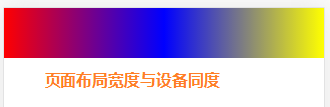
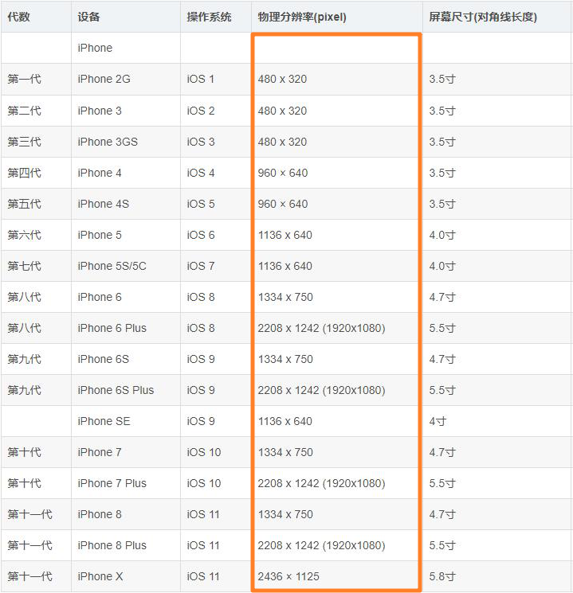
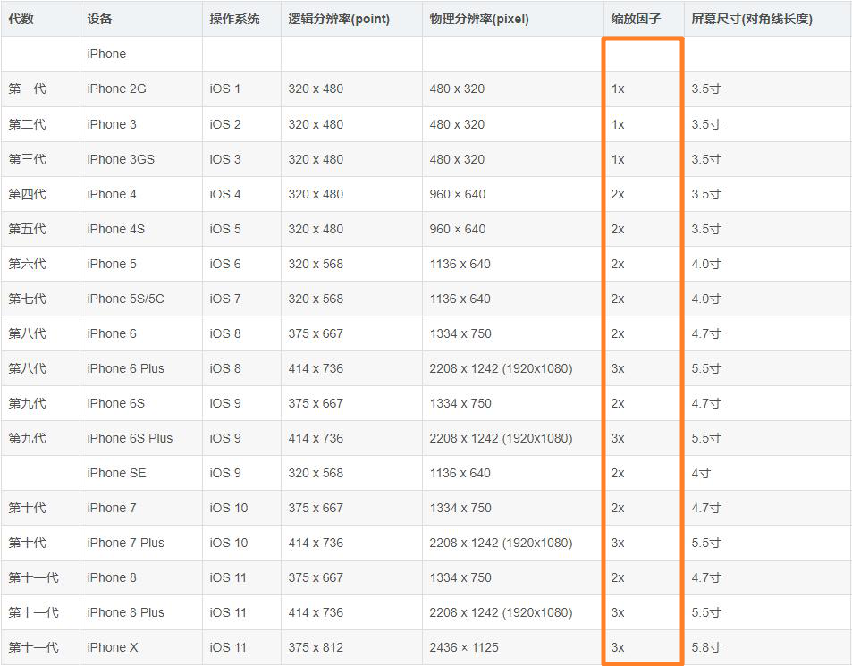

## 视口(viewport)简介

简单的讲视口就是手机屏幕用于显示网页的窗口(**pc端是没有视口的，视口是移动设备专有的名词**)。


早期手机上显示网页的效果如上图，浏览者必须通过移动页面才可以看到其余部分。这样操作起来十分不便。

为了让用户有良好的浏览体验，现在在进行移动端布局时都会将页面**宽度**设计成与**视口宽度**一致。这样页面在移动端显示时就会自动全屏显示。

那么我们的代码要如何写才可以将页面的宽度与视口相同呢？

百分比？	百分比解决不了这个问题！

固定宽度？	移动设备尺寸不同，无法固定宽度！


**通过meta标签设置viewport来解决这个问题。**

 ```html
 <meta name="viewport" content="width=device-width, initial-scale=1.0, maximum-scale=1.0, user-scalable=0">
 ```

 name		要设置的属性，viewport对视口进行设置。

 content	针对viewport设置那些内容。

 - width=device-width	作用是将要展示的**页面布局**的宽度与设备的宽度相同。
 - initial-scale=1.0             初始缩放为1(不缩放)
 - maximum-scale=1.0       最大的缩放比例(不缩放)
 - user-scalable=0              是否允许用户缩放

vscode快捷方式 meta:vp + tab

:point_right: 移动端的页面上写入以上代码，就可以实现不用为页面整体宽度设置一个固定值，就可以将页面的宽度设置为任何一个移动设备屏幕的宽度。

示例：未设置viewport

> 

示例：设置viewport

> 
>
> 


## 2. 像素(屏幕像素)简介

### 2.1 手机屏幕尺寸与ppi


:point_right: `手机屏幕的尺寸是使用对角线进行度量的(单位是英寸: 1英寸 = 2.54 厘米)`

:point_right: `屏幕还有另一个重要的ppi参数，每英寸所包含像素点。同等尺寸下ppi越大像素密度越大。`

---

### 2.2 物理像素(设备像素、分辨率)

像素，可以的一个发光点。大量的发光点组成了屏幕。


物理像素指的是一块屏幕是由多少个发光点组成。




:point_right: 移动端的屏幕不会向pc端那样可以自定义分辨率。


---

### 2.3 逻辑像素(设备独立像素、css像素)

在讲解逻辑分辨率之前首先看一个假设。假设我们css中的像素直接使用物理像素会怎么样？

假设在css中写了一段代码。一个div的width:12px; height:12px。

:point_right: `不要使用css代码去演示如下示例。因为只要在机器上运行，就会进行了逻辑像素与物理像素的转换。以下示例只是理论。`


同样的一段代码，在不同的设备上显示的效果差别太大。这样的话非常不利于页面的布局(因为不知道页面是在哪种分辨率下展示)。

移动屏幕生产商也意识到了这样的问题，为了解决这样的问题，除了提供了物理像素这种参数，还为我们**前端人员**提供了一个重要的参数——逻辑像素。让前端人员在代码中参照逻辑像素来书写尺寸。


移动屏幕生产商，提供的逻辑像素的作用就是，移动端屏幕在显示我们的页面时，会将css中书写的像素数，自动转换为相应的物理像素数。有了这种自动转换，一个css尺寸在不同的设备上几乎是相同的。


物理像素虽然是衡量屏幕的一个重要参数，但与前端人员几乎是没有关系的。前端人员会参照生产商提供的逻辑像素尺寸，在css定义元素的长度、宽度等尺寸，所以逻辑像素又被称之为css像素。


逻辑像素与物理像素形成一个**==比例==**。



移动端屏幕在显示我们的效果时，在读取我们css中的像素时后会根据**==比例==**自动进行转换为相应的物理像素。


---

4. 小结

:point_right: 移动设备上的物理像素 、逻辑像素 与 设备像素比都是出厂是就已经确定的，无法更改的，也不能使用代码控制。

:point_right: 实际开发中，我们只需要考虑逻辑分辨率，不需要考虑物理分辨率。物理分辨率与逻辑分辨率的差距屏幕会自己根据比例进行转换。让同一段代码在不同的设备上显示的视觉效果尽能的相差无几(无法作到任何屏幕都百分百一致)。

:point_right: 对比于逻辑像素我们还需要稍加关注的是在代码中要写多少像素才可以使用页面整体布局与屏幕同宽(言外之意就是代码中如果你写了一个固定的尺寸，在移动端的屏幕上大致占据多大的位置，要有感觉)。

例如：对于逻辑分辨率是 320 x 480的屏幕，设置width:320px，就可以占满整个屏幕的宽度。如果想占据屏幕一半的宽度就设置为width:160px;


## 3. 屏幕分类

### 3.1 dpr(==D==evice ==P==ixel ==R==atio) 设备像素比

设备物理像素与逻辑像素的比例

dpr = 设备物理像素 / 逻辑像素


### 3.2 屏幕种类

		dpr=1	就是普通屏幕(1倍屏)
	
		dpr=2	就是**高清屏幕**(2倍屏)
	
		ppi>300	称之为视网膜屏幕


小结：

	我们在代码中所定的是css像素(逻辑像素)。
	
	我们所书写的代码，在不同的屏幕上，会自动转换为相就的物理像素来显示
	
		在1x上使用1倍进行显示
	
		在2x上使用2倍进行显示
	
		在3x上使用3倍进行显示


## 4. 高清屏图像适配

### 4.1、图片特点

在进行移动端布局时，我们除了要知道逻辑像素进行适配屏幕宽度。

还需要知道不同的屏幕也需要不同的图像进行适配才能达到最好的效果。

图像的特点：放大会失真，缩小不会。


请看需求：

>  在一个页面有1个200px * 140px的图片区域。此页面即要在1倍屏幕上显示，又要在2倍屏幕上显示。
>
>  那么请问，你要让ui人员设计多大分辨率的图片？是200 * 140还是400 * 280。我们需要让ui人员设计400 * 280分辨率的图片。

原因如下：

> + 在dpr为1的普通屏幕上：由于1个css像素对应1个设备像素，此时可以正常显示
>
> 
>
> + 在dpr为2的高清屏莫上：由于1个css像素对应4个设备像素，相当于屏幕分辨率变大了，图片像素数没有变化，图像显示会失真。
>
> 


结论：

> :point_right: 对于高清屏幕需要适配高清图像，才可以展示最好的效果。所以DPR为2的设备上，为了更好的效果，我们要让UI提供400px*280px图片。

### 4.2、图片适配方案

移动端屏幕分为1倍屏(dpr=1)、2倍屏(dpr=2)、3倍屏(drp=3)，理论上ui应该对一个页面上的图片设计3套图片。

由于1倍屏几乎很少见了，所以正规公司UI只会切一套2倍图和一套3倍图，共两套图片。

对于小公司来讲，由于人眼无法区别出差别，一般就只切出一套2倍图。

+ 1套图适配方案

> 如果是1套图适配方案，那么UI提供的都是二倍图，也就是如果页面图片的显示区域是200 * 140的，ui人员会将图片设计成400 * 280。
>
> 那么前端人员的css代码方案应该如下：
>
> ```html
> img{
> 	width:200px;
> 	height:140px;
> }
> ```
>
> :point_right: `如果是1套图，UI的设计稿都是基于DPR为2的移动设备。UI提供的是二倍图，如果是二倍图css的尺寸需要除2。`

+ 多套图适配

> \
>
> > srcset属性用于设置几倍屏使用几倍图片
> >
> > ```html
> > <!DOCTYPE html>
> > <html lang="en">
> > <head>
> > <meta charset="UTF-8">
> > <title>Document</title>
> > </head>
> > <link rel="stylesheet" href="">
> > <script></script>
> > <body>
> > 
> > </body>
> > </html>
> > ```
>
> 

:point_right: 多套图或者是多倍图的作用就是让显示效果更清晰。

## 5. 移动端布局流程

### 5.1 布局的流程

> 1.ui会设计效果图
>
> > ui人员会选择dpr为2的设备来设计效果图。
> >
> > 常见的尺寸：640px、750px、960px
> >
> > :point_right:   ui人员在设计效果图时，使用的是物理像素。
>
> 2.前端人员编码
>
> > 前端人员在编码时，需要转换为逻辑像素。
> >
> > 如果ui提供的是2倍的效果图，我们需要将所有的尺寸除2。 宽、高、字体大小、内外边距。
> >
> > 如果是pc端的设计稿就是按设计稿上的物理像素来书写css尺寸。
>


### 5.2 注意事项


- 水平方向不允许出现滚动条

> 元素宽度不能超过视口宽度  
>
> 禁止用户缩放
>
> <meta name="viewport" content="width=device-width,initial-scale=1.0,maximum-scale=1.0,user-scalable=0">

- 只进行宽度适配

> 页面整体宽度适配视口
>
> 使用百分比单位，高度使用固定px或内容撑开
>
> `百分比布局也称之为流式布局，流式布局并不是一种新的布局技术，而是百分比布局的`

- 盒子采用内减模式	box-sizing:boder-box

> 盒子不受padding、border的影响避免出现滚动条。

示例代码：

> ```html
> <!DOCTYPE html>
> <html lang="en">
> <head>
> <meta charset="UTF-8">
> <!-- 
>   user-scalable=no控制用户不能缩放，如果缩放就会出现滚动条
> -->
> <meta name="viewport" content="width=device-width, initial-scale=1.0, maximum-scale=1.0, user-scalable=no">
> <title>Document</title>
> <link rel="stylesheet" href="">
> <style>
>   *{
>       margin:0;
>       padding:0;
>   }
> 
>   div{
>       /* 盒子的宽度不能大于视口的宽度，如果大于就会出现滚动条 */
>       /* width:500px; */
>       /* 宽度使用百分比，高度使用px或内容撑开 */
>       width:100%;
>       height:100px;
>       background:red;
> 
>       padding:20px;
>       /* 盒子采用内减模式，避免出现滚动条 */
>       box-sizing: border-box;
>       border:5px solid red;
>   }
> </style>
> </head>
> <body>
> <div>
>   hello
> </div>
> 
> </body>
> </html>
> ```
>
> 


:point_right: `父盒子采用内减模式后，子盒子宽度再设置为100%时，子盒子的宽度是相对于父盒子内容的宽度(父盒子的width - border - padding)。此时子盒子再设置padding、border、margin并不会从子盒子的尺寸上减去。如果子盒子设置了box-sizing:border-box;当设置padding、border时会自动减去。`