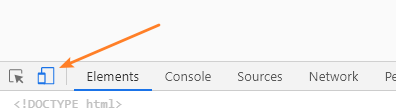
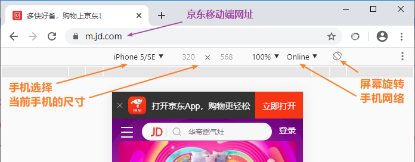

## 什么是移动web

用于展示在**移动设备**上的网页(web)，称之为移动端页面。

移动设备泛指**手机、平板**等设备。

## 如何调试移动web页面

+ 真机调试：

需要服务器环境，网络环境，以及多部手机。

目前还没有学习服务器技术，网络环境也不具备，所以暂时无法进行真机调试。

+ 浏览器模拟：

一些浏览器为前端开发者提供了真机调试模拟环境。例如：chrome。

打开开发者工具，点击手机图标即可切换到模拟环境。

 

 

## 移动web发展历程

- 从2014年10月HTML5标准规范最终发布后，移动web就迎来了飞速的发展。因为使用HTML5技术可以更方便 更快捷的开发现代web应用程序 
- 而移动端的手机浏览器都是比较新的 HTML5在移动端的浏览器支持情况都比较好 
- 所以HTML5主要应用就是在移动端 移动web开发中。
- 至今  移动web已经发展了很多年 各方面的技术都比较成熟稳定 网上的教程也比较完整成熟 所以现在的web已经到全民移动web的时代了
- 移动互联网商业模式多样化，移动互联网超越PC互联网，引领发展新潮流。

## 移动端布局特点

有人说手机端无非就是PC端的移植，功能设计照搬就行了，这是对于移动设计最大的误解，其实PC端与移动端的差别还是比较大的。
> **移动端页面与pc端页面的区别**

**a. 多机型适配**

pc端页面不需要考虑机型适配的问题

pc端的屏幕都是比较大的，就算浪费一点尺寸也是可以忍受的

但是移动端的设备机型尺寸特别多，需要考虑不同的机型尺寸

移动端的屏幕尺寸远小于pc端，如果再浪费，那就是不可忍受的了,所以要考虑多种机型，要让页面效果在任何屏幕尺寸上都100%。让效果与屏幕同宽。

---

 **b. 页面结构简单**

 由于移动设备的屏幕远小于pc端，不采用很花哨的页面结构。

 由于移动端的性能远不如pc端，所以网页不会很复杂。

 **常见的移动web页面结构：**

-  广告栏

- 搜索栏

- 轮播图

- 导航栏

- 商品列表
- 底部

> **移动web布局的核心思想**

 **a. 不允许出现水平滚动条**

pc端屏幕比较宽，多数采用固定宽度，水平居中两边留白的方式来布局，所以pc端不需要考虑屏幕宽度

移动端屏幕都是很小的，可用的显示宽度是有限的，所以要占据所有可用的宽度，但是不同的手机屏幕宽度不一样，这就要考虑屏幕适配问题

 **b. 页面整体宽度与屏幕一致**

 **c. 盒子采用内减模式(怪异盒子模型、IE盒子模型、c3盒子模型)		box-sizing:border-box**

3. 移动web布局方式介绍

 **a. 流式布局**

使用百分比实现布局(百分比布局)

 **b. 弹性布局**

flex

 **c. rem布局**

以html根标签上设置的字体大小作为一个相对量。

 **d. 响应式布局**
